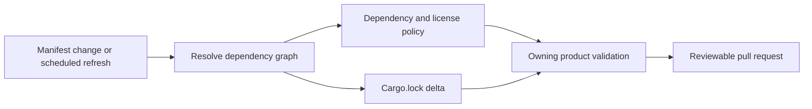

# Dependency Updates

Dependency changes alter compiled behavior, licenses, reproducibility, and the
release supply chain. Atlas therefore separates graph review from lockfile
generation and requires the resulting pull request to carry ordinary product
evidence.

```mermaid
flowchart LR
    Trigger[Manifest change or scheduled refresh] --> Resolve[Resolve dependency graph]
    Resolve --> Review[Dependency and license policy]
    Resolve --> Lock[Cargo.lock delta]
    Review --> Product[Owning product validation]
    Lock --> Product
    Product --> PR[Reviewable pull request]
```

## Checked-In Authorities

| Authority | Responsibility | Important limit |
| --- | --- | --- |
| `.github/workflows/dependency-review.yml` | runs GitHub dependency review on pull requests | reviews the submitted graph delta; it does not generate a lockfile or run product behavior tests |
| `.github/workflows/dependency-lock.yml` | scheduled or manually dispatched lockfile refresh | runs `cargo generate-lockfile`, verifies the result, and opens a pull request on `automation/dependency-lock-refresh` |
| `configs/sources/release/dependency-policy.json` | declares forbidden licenses, duplicate threshold, and cargo-deny policy | `cargo_deny.required` is currently `false`; its presence must not be reported as a mandatory gate |
| `Cargo.toml` and `Cargo.lock` | declare requested and resolved Rust dependencies | neither file explains runtime or release impact by itself |

The lock workflow is the only checked-in automated path that refreshes
`Cargo.lock`. Its pull request is still a proposal: automation does not waive
review, compatibility analysis, or the tests appropriate to the affected
crate.

## Evidence by Change Type

- A development-only dependency needs graph review and the maintainer checks
  that exercise its command or generator.
- A runtime dependency needs graph review plus focused behavior and
  compatibility evidence from its owning crate.
- A security-sensitive change needs the relevant advisory or policy result and
  proof that the patched path was exercised.
- A release, packaging, or toolchain dependency needs reproducibility and
  publication-path evidence in addition to compilation.

Review the manifest and lockfile together. Unexpected package additions,
feature activation, duplicate versions, or source changes are part of the
change even when the direct dependency line looks small. Record what was run
and distinguish checks executed on the pull request from policies that are
merely declared in configuration.
