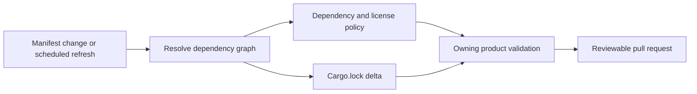
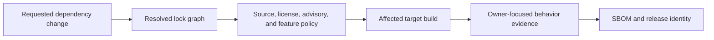

# Dependency Updates

Dependency changes alter compiled behavior, licenses, reproducibility, and the
release supply chain. Atlas therefore separates graph review from lockfile
generation and requires the resulting pull request to carry ordinary product
evidence.

```mermaid
flowchart LR
    Trigger[Manifest change or scheduled refresh] --> Resolve[Resolve dependency graph]
    Resolve --> Review[Dependency and license policy]
    Resolve --> Lock[Cargo.lock delta]
    Review --> Product[Owning product validation]
    Lock --> Product
    Product --> PR[Reviewable pull request]
```

## Checked-In Authorities

| Authority | Responsibility | Important limit |
| --- | --- | --- |
| `.github/workflows/dependency-review.yml` | runs GitHub dependency review on pull requests | reviews the submitted graph delta; it does not generate a lockfile or run product behavior tests |
| `.github/workflows/dependency-lock.yml` | scheduled or manually dispatched lockfile refresh | runs `cargo generate-lockfile`, verifies the result, and opens a pull request on `automation/dependency-lock-refresh` |
| `configs/sources/release/dependency-policy.json` | declares forbidden licenses, duplicate threshold, and cargo-deny policy | `cargo_deny.required` is currently `false`; its presence must not be reported as a mandatory gate |
| `Cargo.toml` and `Cargo.lock` | declare requested and resolved Rust dependencies | neither file explains runtime or release impact by itself |

The lock workflow is the only checked-in automated path that refreshes
`Cargo.lock`. Its pull request is still a proposal: automation does not waive
review, compatibility analysis, or the tests appropriate to the affected
crate.

## Evidence by Change Type

- A development-only dependency needs graph review and the maintainer checks
  that exercise its command or generator.
- A runtime dependency needs graph review plus focused behavior and
  compatibility evidence from its owning crate.
- A security-sensitive change needs the relevant advisory or policy result and
  proof that the patched path was exercised.
- A release, packaging, or toolchain dependency needs reproducibility and
  publication-path evidence in addition to compilation.

Review the manifest and lockfile together. Unexpected package additions,
feature activation, duplicate versions, or source changes are part of the
change even when the direct dependency line looks small. Record what was run
and distinguish checks executed on the pull request from policies that are
merely declared in configuration.

## Resolve the Complete Change

A direct version edit can alter more than one package. Review the resolved
graph by ownership and effect:

| Graph change | Risk to investigate | Focused evidence |
| --- | --- | --- |
| new package | source, license, maintainer, feature, build script, and transitive graph | dependency review plus owning crate behavior |
| source change | registry, Git revision, checksum, or local path trust boundary | exact source identity and reproducible resolution |
| feature change | newly compiled code, native dependency, platform behavior, or default policy | feature graph and affected target tests |
| duplicate version | larger attack and maintenance surface or incompatible types | justification, convergence plan, and binary impact |
| build dependency | code execution during compilation | builder isolation, toolchain, and generated-output review |
| native or system dependency | ABI, architecture, packaging, and runtime availability | supported-target build and deployment evidence |

Do not evaluate only the package named in the manifest diff. The lockfile is
the resolved build input, and activated features determine which parts of that
graph can affect produced bytes.

## Dependency Trust Receipt

```mermaid
flowchart LR
    Intent[Requested dependency change] --> Resolve[Resolved lock graph]
    Resolve --> Policy[Source, license, advisory, and feature policy]
    Policy --> Build[Affected target build]
    Build --> Behavior[Owner-focused behavior evidence]
    Behavior --> Artifact[SBOM and release identity]
```

Retain the manifest and lockfile hashes, resolver and Rust toolchain versions,
changed source and checksum identities, activated features, advisory database
identity, policy revision, affected package set, focused test results, and
resulting SBOM identity. An advisory scan without its database timestamp and
policy cannot be reproduced later.

## Update Decision

Accept an update only when:

- the resolved change matches the requested scope;
- source and checksum changes are understood;
- license, advisory, and exception decisions are attributable;
- changed features and target support are exercised;
- public API, serialization, output, and operational behavior remain inside
  their compatibility contracts; and
- release evidence can bind the new graph to produced artifacts.

Hold the update when a required scanner is unavailable, the graph contains an
unreviewed source, native target evidence is missing, or the lockfile includes
unexplained movement. A successful lockfile generation proves resolution, not
acceptance.

Use [Compatibility Matrix](compatibility-matrix.md) when the dependency changes
an observed surface and the operations
[Supply Chain and Artifact Trust](../../bijux-atlas-ops/security/supply-chain-and-artifact-trust.md)
guide for consumer verification.
