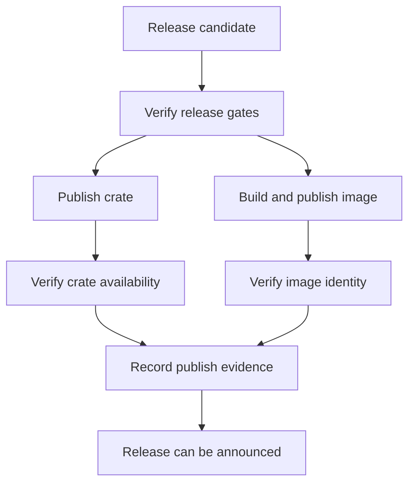

# Docker and Crate Publish

Docker and crate publication are separate delivery paths with different
credentials, evidence, and review concerns.

## Publish Model

This diagram is here because crate and image publication are related but not
identical. They share release gates, but they diverge in credentials, artifacts,
and the evidence a maintainer needs to confirm after publication.

## Workflow Anchors

- [`.github/workflows/release-crates.yml`](/Users/bijan/bijux/bijux-atlas/.github/workflows/release-crates.yml:1) is the crates.io publish path
- [`.github/workflows/docker-publish.yml`](/Users/bijan/bijux/bijux-atlas/.github/workflows/docker-publish.yml:1) is the container publish path
- crate and image release policy inputs live under [`configs/sources/release/`](/Users/bijan/bijux/bijux-atlas/configs/sources/release)

## Main Takeaway

Docker and crate publish should never be treated as one vague "release push."
Atlas keeps them as separate delivery paths so maintainers can verify crate
availability, image identity, provenance, and publish evidence with the right
tooling and policy for each artifact class.
