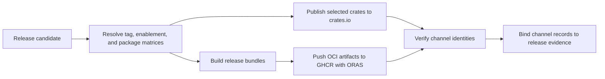

# Crate and GHCR Publication

Crates.io and GHCR are separate release channels with different payloads,
credentials, naming, and verification obligations. The current GHCR workflow
publishes compressed release bundles as OCI artifacts through ORAS; it does not
publish runnable Docker images.

## Publish Model

```mermaid
flowchart LR
    Candidate[Release candidate] --> Plan[Resolve tag, enablement, and package matrices]
    Plan --> Crates[Publish selected crates to crates.io]
    Plan --> Build[Build release bundles]
    Build --> GHCR[Push OCI artifacts to GHCR with ORAS]
    Crates --> Verify[Verify channel identities]
    GHCR --> Verify
    Verify --> Packet[Bind channel records to release evidence]
```

Both workflows resolve to a no-op unless publication is enabled and their
package inputs produce work. A manually dispatched no-op is rejected. This
prevents an apparently successful dispatch from being mistaken for a publish.

## Channel Contracts

| Channel | Published payload | Authorization | Identity to verify |
| --- | --- | --- | --- |
| crates.io | selected Rust packages in workspace publish order | `CARGO_REGISTRY_TOKEN` after the configured credential check | crate name and immutable version |
| GHCR | one compressed release bundle per configured package, wrapped as an OCI artifact | GitHub package write permission and ORAS login | package reference, `v*` tag, source revision annotation, artifact type, and archive digest |

The crates workflow can skip versions that already exist when configured to do
so. That makes reruns more tolerant, but it does not prove that an existing
registry version contains the bytes expected by the current candidate. The
release packet must compare the registry identity with the candidate's package
and checksum records.

The GHCR workflow may add `latest` for a non-prerelease tag. Consumers making a
reproducible decision must use the immutable release tag or digest; `latest` is
a convenience pointer, not release identity.

## Promotion Evidence

For each enabled channel, retain:

- source revision, release tag, selected package matrix, and workflow run;
- the exact registry name and version or OCI reference and digest;
- the build artifact identity used as publication input;
- credential and publication outcome without secret material;
- post-publication lookup or pull evidence;
- checksums and provenance that bind the registry object to the release packet.

A successful upload establishes channel acceptance. It does not establish that
every release channel is coherent or that the published artifact can be used
as a runnable container image.

## Workflow Anchors

- crates.io workflow: [`.github/workflows/release-crates.yml`](https://github.com/bijux/bijux-atlas/blob/main/.github/workflows/release-crates.yml)
- GHCR OCI workflow: [`.github/workflows/release-ghcr.yml`](https://github.com/bijux/bijux-atlas/blob/main/.github/workflows/release-ghcr.yml)
- shared bundle builder: [`.github/workflows/release-artifacts.yml`](https://github.com/bijux/bijux-atlas/blob/main/.github/workflows/release-artifacts.yml)
- release policy: [`configs/sources/release/`](https://github.com/bijux/bijux-atlas/tree/main/configs/sources/release/)

[Distribution Channels](../../bijux-atlas-ops/release/distribution-channels.md)
defines the consumer-facing channel model. [Signing and Provenance](../../bijux-atlas-ops/release/signing-and-provenance.md)
defines the identity binding expected beyond upload.
