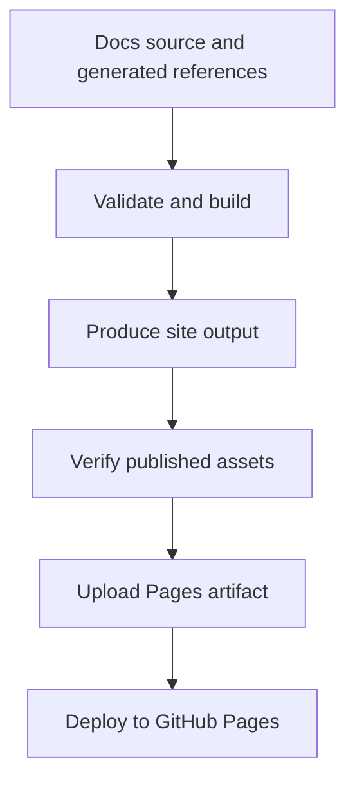

# Docs Deploy Pipeline

Docs deployment is a governed delivery path and should stay aligned with docs
validation and generated site assets.

## Docs Deploy Model

This page exists because a successful docs build is not the same thing as a trustworthy docs deploy.
Atlas treats deployment as a controlled pipeline with output contracts, asset checks, and a named
publishing workflow.

## Source Anchor

[`.github/workflows/deploy-docs.yml`](/Users/bijan/bijux/bijux-atlas/.github/workflows/deploy-docs.yml:1)
is the source of truth for the current docs deployment path.

## What The Pipeline Verifies

The deploy workflow currently:

- installs the Rust, Python, and Node toolchains needed by the docs stack
- validates the mkdocs output directory contract and related site configuration assumptions
- runs the docs check/build path
- verifies published root assets such as `favicon.ico` and the Apple touch icons
- uploads `artifacts/docs/site` as the Pages artifact and deploys it from `main`

## Why This Matters

- broken site roots and missing assets are reader-facing regressions
- generated references must already be aligned before deployment begins
- docs deployment should prove the published site contract, not only that local markdown parsed

## Main Takeaway

The docs deploy pipeline is Atlas's publish-time promise for reader-facing documentation. It must
carry forward validated source content, correct generated references, and a complete site artifact,
or the deployment is incomplete even if the build technically succeeded.
