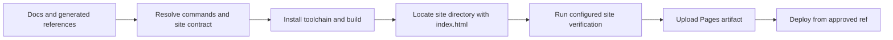

# Docs Deploy Pipeline

Documentation deployment turns validated source into a GitHub Pages artifact.
The workflow resolves repository-specific install, build, verify, site URL, and
site directory settings before it installs tools or publishes output.

## Docs Deploy Model

```mermaid
flowchart LR
    Source[Docs and generated references] --> Resolve[Resolve commands and site contract]
    Resolve --> Build[Install toolchain and build]
    Build --> Locate[Locate site directory with index.html]
    Locate --> Verify[Run configured site verification]
    Verify --> Upload[Upload Pages artifact]
    Upload --> Deploy[Deploy from approved ref]
```

Build success, artifact validity, Pages deployment, and public reachability are
different claims. The workflow must preserve those distinctions in its result
and in any release evidence that cites the documentation site.

## Resolution and Publication

The workflow resolves configuration from repository variables, environment,
and `.github/docs-deploy.env`, then falls back to discovered Make targets. It
fails if no build command can be found. Python, uv, Node, and Rust setup are
enabled according to the resolved repository shape unless explicitly
configured.

After the build, the workflow searches the configured site directory and known
artifact roots for a directory containing `index.html`. If none is found, it
may invoke the repository's `docs` Make target as a fallback. The selected
directory is passed to the configured verification command, then checked for a
directory and root `index.html` before upload.

Deployment occurs only for a reusable workflow call, `main`, `master`, or a
`v*` tag. Manual dispatch from another ref is rejected because it would build
without reaching the deployment boundary.

## Evidence Strength

| Observation | Safe conclusion | Still required for a stronger claim |
| --- | --- | --- |
| source validation passed | Markdown, metadata, navigation, and checked links satisfy the configured validator | rendered-site and deployment evidence |
| site directory contains `index.html` | a candidate Pages bundle has a root document | asset completeness and route behavior |
| configured site verifier passed | repository-specific publish checks accepted the selected bundle | Pages deployment result |
| upload action passed | GitHub accepted the artifact | successful deployment and public fetch |
| deploy action returned a URL | Pages reported a deployment | external route, asset, redirect, and cache checks when required |

The shared workflow itself guarantees only the generic root `index.html` check
unless the repository's resolved verify command enforces more. Asset, redirect,
search, canonical URL, and public smoke-test claims must name the command or
post-deploy observation that proves them.

## Operational Record

Retain the source revision, resolved site URL and directory, resolved commands,
tool versions, verification result, Pages artifact identity, deployment URL,
and workflow run. A public-site incident can then distinguish stale source,
build drift, incomplete assets, Pages failure, and routing failure.

Workflow authority: [`.github/workflows/deploy-docs.yml`](https://github.com/bijux/bijux-atlas/blob/main/.github/workflows/deploy-docs.yml).
Repository documentation checks are described in
[Docs Governance Workflow](../workflow-ownership/docs-governance-workflow.md).
