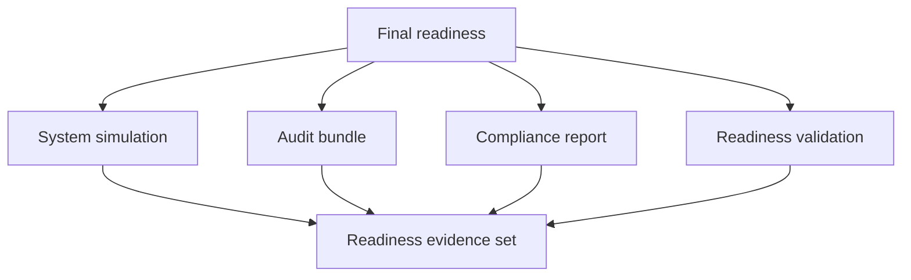

# Final Readiness

Final readiness lanes exist so large release decisions are not reduced to one
green unit-test run.

## Readiness Model

This page exists to make readiness explicit. Atlas treats final readiness as a collected evidence
state across simulation, audit, compliance, and readiness validation, not as a subjective feeling
that the release seems fine.

## Source Anchor

[`.github/workflows/final-readiness.yml`](/Users/bijan/bijux/bijux-atlas/.github/workflows/final-readiness.yml:1)
is the source of truth for the current final-readiness lane.

## What The Workflow Produces

The current workflow:

- runs `system simulate suite`
- generates an audit bundle
- builds an audit compliance report
- runs readiness validation
- uploads the resulting `artifacts/audit` bundle for review

## How Maintainers Should Use It

- treat the uploaded artifacts as the readiness packet, not as incidental by-products
- compare the readiness packet against the release-candidate and versioning story
- block promotion when simulation, compliance, or readiness validation contradict the release narrative

## Main Takeaway

Final readiness is Atlas's last integrated release judgment. It exists so the repository can prove
that system behavior, audit material, and compliance evidence still agree before public promotion.
