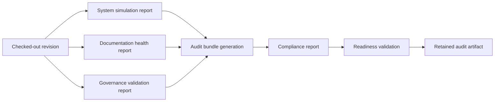
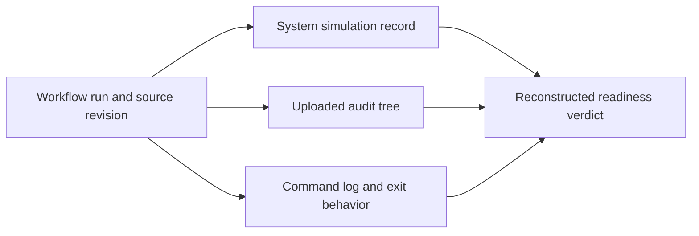

# Final Readiness

The final-readiness workflow assembles integrated repository evidence for
system simulation, documentation health, governance, audit, compliance, and
readiness validation. It is a review input, not an automatic declaration that
packages, clusters, load scenarios, security controls, or rollback paths all
passed.

## Workflow Evidence Flow

```mermaid
flowchart LR
    Source[Checked-out revision] --> Sim[System simulation report]
    Source --> Docs[Documentation health report]
    Source --> Gov[Governance validation report]
    Sim --> Audit[Audit bundle generation]
    Docs --> Audit
    Gov --> Audit
    Audit --> Compliance[Compliance report]
    Compliance --> Ready[Readiness validation]
    Ready --> Upload[Retained audit artifact]
```

The workflow is defined in
[`.github/workflows/final-readiness.yml`](../../../.github/workflows/final-readiness.yml).
It runs on manual dispatch and on pull requests that touch its selected audit,
documentation, operations, or workflow paths.

## Produced Records

| Record | Role |
| --- | --- |
| `artifacts/system/simulation/run.json` | system-simulation command result used during assembly |
| `artifacts/audit/docs-health.json` | documentation health snapshot |
| `artifacts/audit/governance-validate.json` | governance command output |
| `artifacts/audit/generate.json` | audit-bundle generation result |
| `artifacts/audit/compliance.json` | audit compliance result |
| `artifacts/audit/readiness.json` | final readiness-validator result |

The uploaded artifact retains `artifacts/audit` for 14 days. The simulation
record sits outside that uploaded path unless another workflow or bundle step
copies or references it. Reviewers must confirm the retained bundle contains
the inputs required by its claims.

## Current Failure Semantics

The shell command that generates `governance-validate.json` is followed by
`|| true`. Its process failure therefore does not stop the workflow at that
step. The captured report must be inspected, and downstream audit/readiness
validation must demonstrate that a governance failure cannot become a green
readiness verdict. Artifact upload uses `if: always()`, so artifact presence
also does not imply job success.

## Reconstruct the Verdict

The uploaded artifact contains `artifacts/audit/`, but the system-simulation
record is produced under `artifacts/system/simulation/` and is not uploaded by
this workflow. A reviewer downloading only the named artifact cannot inspect
that upstream record from the bundle alone.

Treat the workflow run, checked-out revision, command logs, simulation output,
and uploaded audit tree as one evidence graph:

```mermaid
flowchart LR
    Run[Workflow run and source revision] --> Log[Command log and exit behavior]
    Run --> Sim[System simulation record]
    Run --> Audit[Uploaded audit tree]
    Sim --> Verdict[Reconstructed readiness verdict]
    Audit --> Verdict
    Log --> Verdict
```

Preserve the simulation record separately or include it in the retained bundle
before claiming the artifact is self-contained. Recalculate the verdict from
internal report statuses; do not use artifact existence or the workflow badge
as a substitute.

## Readiness Decision

Accept the workflow as scoped evidence only when:

- the run identifies the intended source revision and is not superseded;
- each required report is present, parseable, and internally successful;
- simulation, audit, compliance, and readiness identities agree;
- skipped, tolerated, or missing work is recorded and compatible with the
  claim;
- the uploaded artifact contains or securely references required raw inputs;
  and
- separate package, security, operational, load, and rollback evidence is
  attached when the release decision requires it.

Reject a readiness claim when a top-level workflow success conflicts with a
failed report, missing input, stale artifact, or unbound candidate identity.
