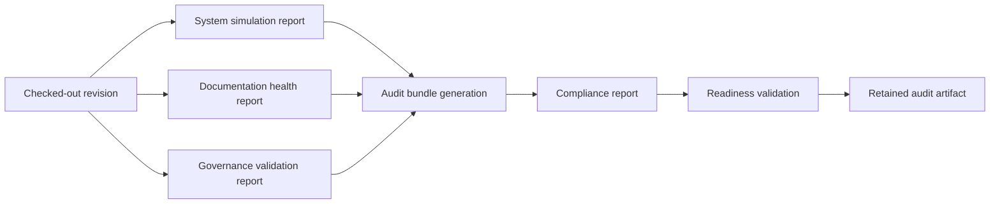
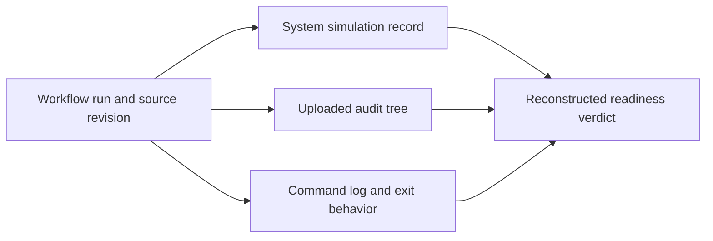
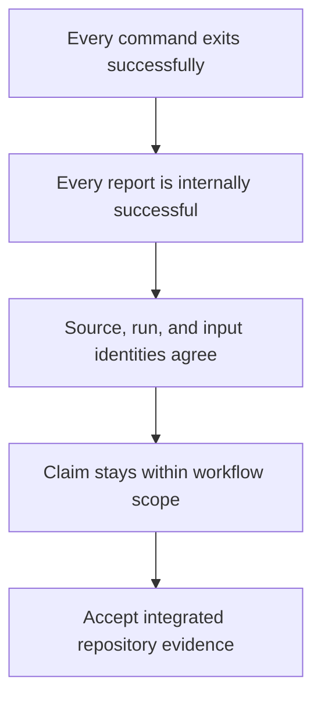

# Final Readiness

The final-readiness workflow assembles integrated repository evidence for
system simulation, documentation health, governance, audit, compliance, and
readiness validation. It is a review input, not an automatic declaration that
packages, clusters, load scenarios, security controls, or rollback paths all
passed.

## Workflow Evidence Flow

```mermaid
flowchart LR
    Source[Checked-out revision] --> Sim[System simulation report]
    Source --> Docs[Documentation health report]
    Source --> Gov[Governance validation report]
    Sim --> Audit[Audit bundle generation]
    Docs --> Audit
    Gov --> Audit
    Audit --> Compliance[Compliance report]
    Compliance --> Ready[Readiness validation]
    Ready --> Upload[Retained audit artifact]
```

The workflow is defined in
[`.github/workflows/final-readiness.yml`](../../../.github/workflows/final-readiness.yml).
It runs on manual dispatch and on pull requests that touch its selected audit,
documentation, operations, or workflow paths.

## Produced Records

| Record | Role |
| --- | --- |
| `artifacts/system/simulation/run.json` | system-simulation command result used during assembly |
| `artifacts/audit/docs-health.json` | documentation health snapshot |
| `artifacts/audit/governance-validate.json` | governance command output |
| `artifacts/audit/generate.json` | audit-bundle generation result |
| `artifacts/audit/compliance.json` | audit compliance result |
| `artifacts/audit/readiness.json` | final readiness-validator result |

The uploaded artifact retains both `artifacts/audit` and
`artifacts/system/simulation` for 14 days. The simulation input and the audit
results can therefore be inspected from one workflow artifact, but they still
need matching source and run identities.

## Failure Semantics

The build step runs with `set -euo pipefail`; simulation, documentation health,
governance, audit generation, compliance, and readiness commands must all exit
successfully. Governance failure is not tolerated. Artifact upload uses
`if: always()` so diagnostics survive a failed build step; artifact presence
therefore does not imply job success.

Each JSON record also has an internal status. Acceptance requires both process
success and internally successful content. A command that exits zero while
emitting a failed or incomplete report is an evidence-contract defect, not a
passing readiness result.

## Reconstruct the Verdict

Treat the workflow run, checked-out revision, command logs, retained simulation
output, and retained audit tree as one evidence graph:

```mermaid
flowchart LR
    Run[Workflow run and source revision] --> Log[Command log and exit behavior]
    Run --> Sim[System simulation record]
    Run --> Audit[Uploaded audit tree]
    Sim --> Verdict[Reconstructed readiness verdict]
    Audit --> Verdict
    Log --> Verdict
```

Recalculate the verdict from internal report statuses; do not use artifact
existence or the workflow badge as a substitute. The bundle is self-contained
for the records this workflow produces, not for package, cluster, load,
security, or rollback evidence produced elsewhere.

## Readiness Claim Matrix

| Input | Direct claim | Required cross-check |
| --- | --- | --- |
| system simulation | selected repository workflows compose under the simulator | simulator scope, fixtures, and source identity |
| documentation health | implemented documentation checks produced the retained report | known baseline findings and skipped external checks |
| governance validation | governed repository rules passed the command | policy revision and generated-input freshness |
| audit bundle | required audit records were assembled | membership, schemas, internal statuses, and checksums |
| compliance report | implemented compliance mappings were evaluated | unresolved findings, exceptions, and expiry |
| readiness report | selected upstream records satisfy readiness policy | exact upstream identities and evidence not owned by this workflow |

```mermaid
flowchart TD
    Process[Every command exits successfully] --> Content[Every report is internally successful]
    Content --> Identity[Source, run, and input identities agree]
    Identity --> Scope[Claim stays within workflow scope]
    Scope --> Accept[Accept integrated repository evidence]
```

A missing input fails the chain. A later report cannot manufacture an earlier
simulation or governance result, and a retained diagnostic file cannot convert
a failed command into success.

## Readiness Decision

Accept the workflow as scoped evidence only when:

- the run identifies the intended source revision and is not superseded;
- each required report is present, parseable, and internally successful;
- simulation, audit, compliance, and readiness identities agree;
- skipped or missing work is recorded and compatible with the claim;
- the uploaded artifact contains or securely references required raw inputs;
  and
- separate package, security, operational, load, and rollback evidence is
  attached when the release decision requires it.

Reject a readiness claim when a top-level workflow success conflicts with a
failed report, missing input, stale artifact, or unbound candidate identity.
