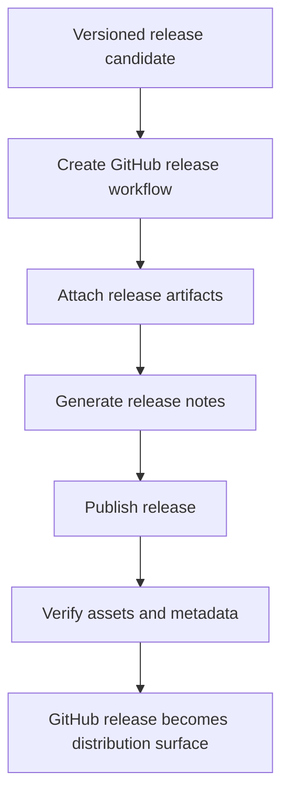

# GitHub Release Workflows

GitHub release flows are declared under `.github/workflows/` and should stay
aligned with release evidence and distribution channels.

## GitHub Release Model

This page exists because GitHub release automation is not just the tail end of
versioning. It is one of Atlas's public distribution surfaces, and the workflow
has to turn the release decision into a coherent asset bundle and note set.

## Workflow Anchor

- [`.github/workflows/release-github.yml`](/Users/bijan/bijux/bijux-atlas/.github/workflows/release-github.yml:1) is the source of truth for GitHub release publication

## Main Takeaway

The GitHub release workflow is Atlas's hosted release packaging path. Its job
is to wait for the right commit state, collect the right assets and notes, and
publish a release record that matches the evidence and distribution story.
