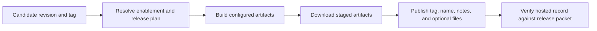

# GitHub Release Workflows

The GitHub release workflow publishes a tag-addressed hosted release record. It
can attach staged artifacts, use an authored notes file, generate release
notes, or publish without assets, depending on resolved release configuration.

## GitHub Release Model

```mermaid
flowchart LR
    Candidate[Candidate revision and tag] --> Resolve[Resolve enablement and release plan]
    Resolve --> Build[Build configured artifacts]
    Build --> Stage[Download staged artifacts]
    Stage --> Publish[Publish tag, name, notes, and optional files]
    Publish --> Verify[Verify hosted record against release packet]
```

The workflow requires a release tag whenever publication is enabled. On push
runs it can wait for a configured CI gate and use a repository-specific plan
command to decide whether to publish, which version and packages are in scope,
and which notes and files belong to the release.

## Publication Variants

| Resolved inputs | Hosted release behavior |
| --- | --- |
| files and notes path | attach matching files and use the authored body |
| files only | attach matching files and optionally generate notes |
| notes path only | publish the authored body without files |
| neither | publish a release record without files and optionally generate notes |

These variants are supported workflow mechanics, not equivalent release
quality. Atlas release policy may require files, checksums, SBOMs, provenance,
or authored notes even though the shared workflow can technically publish
without them.

## Replacement and Identity

When configured, the workflow may delete an existing hosted release before
publishing the resolved record and may overwrite files with matching names.
That behavior makes reruns possible, but it means the hosted release URL alone
is not immutable evidence. Consumers should verify tag commit, asset digests,
notes identity, provenance, and the release-packet manifest.

The publication action reports whether GitHub accepted the release. The
workflow does not perform a universal post-publication download and checksum
verification after the release action. Any claim that hosted assets match the
candidate therefore requires a separate verifier or retained channel evidence.

## Release Record

Retain:

- candidate source revision and resolved `v*` tag;
- release name, notes source, and generated-notes decision;
- staged artifact run, artifact pattern, and matched file inventory;
- hosted release identifier and asset URLs;
- checksums and provenance verified after publication;
- workflow run and any replacement of a prior hosted release.

Do not infer crates.io or GHCR success from the GitHub release result. Each
channel has separate credentials, payloads, and verification.

## Workflow Anchor

- hosted release workflow: [`.github/workflows/release-github.yml`](../../../.github/workflows/release-github.yml)
- artifact builder: [`.github/workflows/release-artifacts.yml`](../../../.github/workflows/release-artifacts.yml)
- operator verification model: [Release Evidence](../../bijux-atlas-ops/release/release-evidence.md)
- channel behavior: [Distribution Channels](../../bijux-atlas-ops/release/distribution-channels.md)
