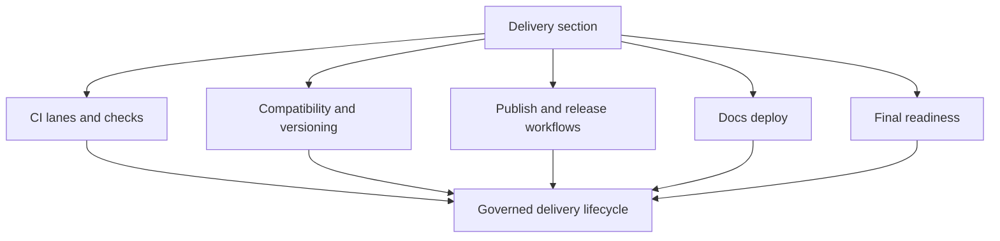

# Delivery

`bijux-atlas-dev/delivery` is the section home for this handbook slice.

Delivery is the governed transition from validated repository state to published
artifacts, deployed docs, release metadata, and required status signals. These
pages should help maintainers understand not just which workflows exist, but
which of them gate PRs, nightly validation, release candidates, and public
publication.

## Delivery Control Map

- workflow execution lives under `.github/workflows/`
- release-specific configs and metadata live under release and packaging sources
- compatibility classification ties delivery to contracts, docs, automation, and
  generated outputs
- final readiness is the last maintainer checkpoint before promotion

## Pages

- [CI Lanes and Status Checks](ci-lanes-and-status-checks.md)
- [Compatibility Matrix](compatibility-matrix.md)
- [Dependency Updates](dependency-updates.md)
- [Docker and Crate Publish](docker-and-crate-publish.md)
- [Docs Deploy Pipeline](docs-deploy-pipeline.md)
- [Final Readiness](final-readiness.md)
- [GitHub Release Workflows](github-release-workflows.md)
- [Load and Benchmark Workflows](load-and-benchmark-workflows.md)
- [Release and Versioning](release-and-versioning.md)
- [Security Validation Lanes](security-validation-lanes.md)
