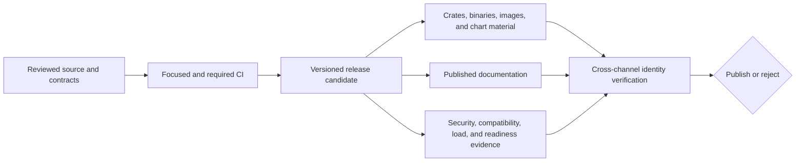
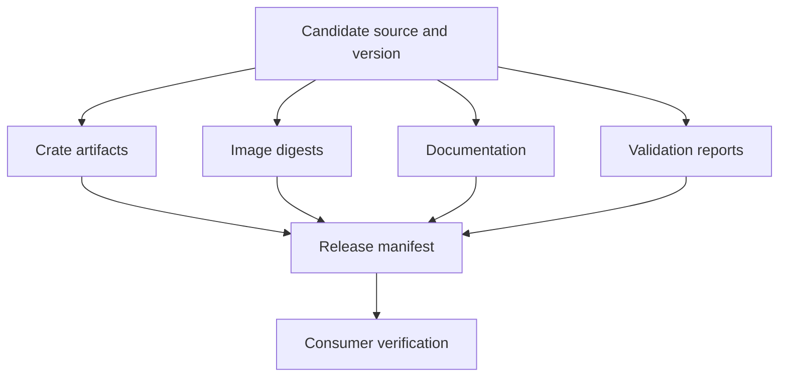
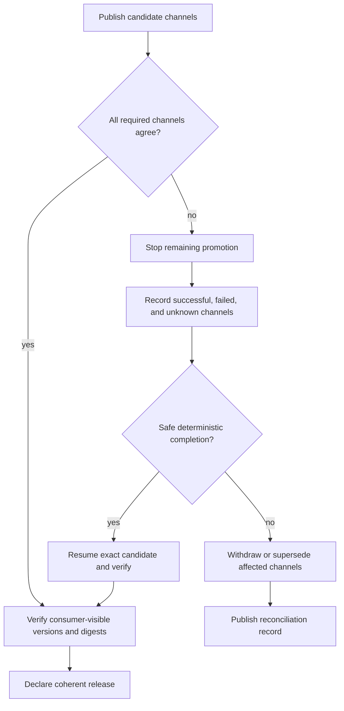

# Delivery

Atlas delivery moves one coherent source identity through validation,
packaging, publication, documentation deployment, and release verification.
Each lane owns a narrower claim; no single green workflow establishes complete
release readiness.

```mermaid
flowchart LR
    Source[Reviewed source and contracts] --> CI[Focused and required CI]
    CI --> Candidate[Versioned release candidate]
    Candidate --> Packages[Crates, binaries, images, and chart material]
    Candidate --> Docs[Published documentation]
    Candidate --> Evidence[Security, compatibility, load, and readiness evidence]
    Packages --> Verify[Cross-channel identity verification]
    Docs --> Verify
    Evidence --> Verify
    Verify --> Decision{Publish or reject}
```

## Delivery Domains

| Decision | Reference | Required agreement |
| --- | --- | --- |
| select required checks | [CI Lanes and Status Checks](ci-lanes-and-status-checks.md) | change scope, workflow trigger, and branch protection |
| classify release compatibility | [Compatibility Matrix](compatibility-matrix.md) | source, target, public surface, and migration direction |
| change dependencies | [Dependency Updates](dependency-updates.md) | lockfile, policy, security, licensing, and reproducibility |
| publish crates and images | [Docker and Crate Publish](docker-and-crate-publish.md) | version, package inventory, digests, provenance, and channel state |
| deploy public docs | [Docs Deploy Pipeline](docs-deploy-pipeline.md) | source revision, generated references, navigation, and deployed version |
| create GitHub release material | [GitHub Release Workflows](github-release-workflows.md) | tag, assets, checksums, notes, and release manifest |
| qualify capacity | [Load and Benchmark Workflows](load-and-benchmark-workflows.md) | scenario, environment, baseline, thresholds, and result |
| govern version movement | [Release and Versioning](release-and-versioning.md) | workspace, artifacts, tags, and compatibility policy |
| assess security | [Security Validation Lanes](security-validation-lanes.md) | threat, supply-chain, and data-protection findings |
| assemble integrated evidence | [Final Readiness](final-readiness.md) | simulation, audit, compliance, and readiness status |

## Cross-Lane Integrity

A release candidate should have one source revision and version identity across
package manifests, images, documentation, generated references, SBOMs,
provenance, checksums, and evidence. If a lane rebuilds or regenerates bytes,
its downstream bindings must be refreshed and reverified.

```mermaid
flowchart TD
    Identity[Candidate source and version] --> Crates[Crate artifacts]
    Identity --> Images[Image digests]
    Identity --> Site[Documentation]
    Identity --> Reports[Validation reports]
    Crates --> Manifest[Release manifest]
    Images --> Manifest
    Site --> Manifest
    Reports --> Manifest
    Manifest --> Consumer[Consumer verification]
```

## Interpret Lane Status

Delivery has more state than green or red:

| State | Meaning | Required action |
| --- | --- | --- |
| passed | the lane's owned checks and internal report status passed for the candidate | retain and bind its evidence |
| failed | the lane executed and rejected the candidate or its evidence | stop the dependent publication path |
| skipped | the lane did not execute for this candidate | narrow the release claim or execute it explicitly |
| tolerated failure | automation continued after a failing command | inspect the failure; never count workflow continuation as a pass |
| published | a channel accepted bytes | verify channel identity and reconcile other channels |

Workflow conclusion and command exit are separate observations. Report status
is another. Uploaded artifact presence and release binding add two more.
Promotion requires all applicable observations to agree.

## Partial Publication Recovery

```mermaid
flowchart TD
    Publish[Publish candidate channels] --> Result{All required channels agree?}
    Result -- yes --> Verify[Verify consumer-visible versions and digests]
    Verify --> Complete[Declare coherent release]
    Result -- no --> Freeze[Stop remaining promotion]
    Freeze --> Inventory[Record successful, failed, and unknown channels]
    Inventory --> Decision{Safe deterministic completion?}
    Decision -- yes --> Resume[Resume exact candidate and verify]
    Decision -- no --> Withdraw[Withdraw or supersede affected channels]
    Resume --> Verify
    Withdraw --> Record[Publish reconciliation record]
```

Do not rebuild an allegedly identical candidate after partial publication.
Resume with retained bytes and source identity. Otherwise issue a new release
identity. A rebuild can produce different digests while preserving the same
human-readable version.

## Failure Rules

- A skipped lane does not pass; it narrows available release claims.
- A successful publish does not repair missing pre-publication evidence.
- A mutable tag or unpinned action is not an immutable artifact identity.
- A report uploaded by a workflow must still be checked for internal failure,
  missing evidence, and candidate binding.
- Partial channel publication requires an explicit reconciliation or withdrawal
  decision; do not silently describe the release as coherent.
