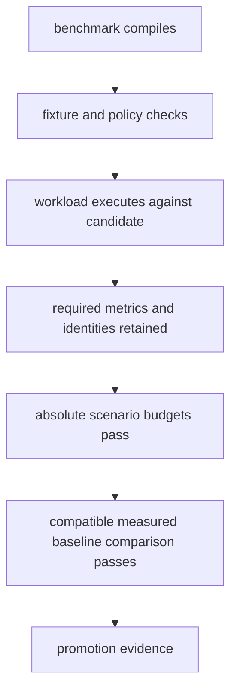

# Load and Benchmark Workflows

Atlas separates executable compilation, fixture regression, load-contract
validation, measured performance, and candidate comparison. These are different
forms of evidence. A green workflow means only that its declared operations
passed.

## Current Automation Surface

| Workflow | What it runs | Evidence it establishes |
| --- | --- | --- |
| `ingest-benchmark-ci.yml` | compiles the `ingest_throughput` benchmark with `--no-run`; runs the ingest benchmark regression fixture test | benchmark target remains buildable and the checked-in fixture contract passes |
| `query-benchmark-ci.yml` | compiles `query_patterns` with `--no-run`; runs query threshold-sanity library tests | query benchmark target remains buildable and fixture thresholds remain internally consistent |
| `load-system-ci.yml` | parses selected JSON; compares the system baseline with itself; runs load manifest and baseline asset tests | registry, generated-file, and deterministic comparison plumbing remain valid |
| `performance-regression-ci.yml` | parses performance assets; compares the system baseline with itself; runs `perf validate` and asset tests | performance policy and report assets are structurally consistent |

None of these operations measures a candidate under load. The benchmark
workflows do not execute Criterion measurements. The load and regression
workflows compare identical baseline inputs, so their zero-delta result proves
determinism rather than candidate performance.

## Evidence Ladder



Every higher claim requires the earlier layers. A compiled benchmark can catch
API drift. A fixture can catch comparison drift. Only an executed candidate run
can provide latency, throughput, saturation, failure, or recovery evidence.

## Running a Measured Candidate

Freeze the source revision, binary or image digest, dataset, query pack,
scenario, thresholds, profile, resources, topology, cache state, tool versions,
and run ID before execution. Then use the governed load sequence:

```bash
bijux-atlas-dev --repo-root "$PWD" load baseline --help
bijux-atlas-dev --repo-root "$PWD" load run --help
bijux-atlas-dev --repo-root "$PWD" load compare --help
```

Use `--help` to select explicit inputs for the installed version. Store raw and
derived results under the run's `artifacts/` directory. Do not replace raw K6,
Criterion, resource, or telemetry data with a console summary.

For microbenchmarks, execute the owned target only when the environment is
suited to measurement. Record CPU model, frequency policy, memory, storage,
operating system, Rust toolchain, competing load, sample configuration, and
Criterion output. Do not compare a local laptop result with a CI runner or
cluster baseline without an explicit comparability decision.

## Result Acceptance

A measured result is complete only when it binds:

- candidate and environment identity;
- exact scenario and query-pack hashes;
- offered load, concurrency, duration, and warmup state;
- required latency, throughput, failure, survival, and resource metrics;
- absolute threshold verdicts;
- compatible baseline and regression verdicts when claimed;
- raw artifacts, failure classification, and command receipt.

Missing required metrics make the run invalid. Deliberate overload shedding
must be separated from transport failures and incorrect successes. A process
exit code alone cannot establish performance acceptance.

## Trigger Coverage

The load-system and performance-regression workflows still list
`docs/04-operations/performance-and-load.md` in their path filters. That path is
not present in the current documentation tree. Changes to the active pages
under `docs/bijux-atlas-ops/load/` therefore do not trigger those workflows by
that documentation rule.

Treat this as a coverage gap. Manually dispatch the relevant workflow when a
documentation change also alters the declared load or regression contract.
When workflow maintenance is in scope, replace obsolete filters with the
active owned paths and verify the changed-file selection.

The ingest benchmark workflow is pull-request and manual only. The query
benchmark workflow runs on pull requests and pushes to `main`. This difference
is scheduling policy, not evidence that one benchmark family is more stable.

## Changing Performance Contracts

Keep these changes separate in review whenever possible:

| Change | Required review evidence |
| --- | --- |
| benchmark implementation | buildability plus measured before-and-after result |
| workload or query pack | new workload identity and baseline comparability decision |
| absolute threshold | user-visible service rationale and representative distributions |
| regression threshold | historical false-positive and false-negative analysis |
| approved baseline | raw repetitions, environment receipt, prior comparison, and approval |
| CI trigger or lane | changed-file coverage and proof that the intended commands execute |

Never refresh a baseline or weaken a threshold merely because a candidate
failed. First determine whether the product regressed, the environment changed,
or the measurement is invalid.

Continue with [Scenario Registry](../../bijux-atlas-ops/load/scenario-registry.md),
[Baseline Management](../../bijux-atlas-ops/load/baseline-management.md), and
[Benchmark CI](../../bijux-atlas-ops/load/benchmark-ci.md).
