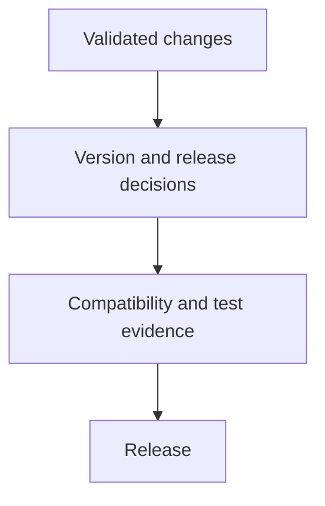
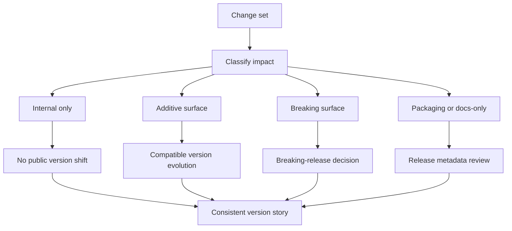

# Release and Versioning

Release work is where local correctness becomes public responsibility.

## Release Flow



This release flow reminds maintainers that versioning is downstream of validated change analysis and
evidence. Release is the public expression of work that was already classified and proven.

## Versioning Model



This versioning model is more useful for maintainers because it starts with the shape of the change,
not with the release label. Release naming comes after impact classification, compatibility review,
and evidence assembly.

## Source Authorities

- [`configs/sources/governance/governance/compatibility.yaml`](/Users/bijan/bijux/bijux-atlas/configs/sources/governance/governance/compatibility.yaml:1) defines what counts as breaking and what rename windows are required
- [`configs/sources/governance/governance/deprecations.yaml`](/Users/bijan/bijux/bijux-atlas/configs/sources/governance/governance/deprecations.yaml:1) records active deprecations and their removal targets
- `.github/workflows/release-candidate.yml`, `release-github.yml`, `release-crates.yml`, and `final-readiness.yml` govern the release lanes and promotion checkpoints
- `.github/release-notes-template.md` defines the public release narrative and evidence checklist expected at publish time

## Maintainer Priorities

- understand which surfaces changed
- understand whether the change is compatible
- ensure release evidence matches the level of change

## Surface-Based Release Review

Use this table to turn a change set into a release decision:

| Changed surface | Typical compatibility reading | Maintainer expectation |
| --- | --- | --- |
| internal refactor with no user, operator, report, or docs-url change | internal only | keep release metadata honest, but do not invent public impact |
| additive CLI, docs, report, or config surface | compatible evolution | update docs and evidence so the new surface is discoverable and proven |
| renamed or removed governed key, check id, report field, or docs URL | potentially breaking | follow the compatibility and deprecation rules before promotion |
| docs-only clarification with no changed contract claim | packaging or docs-only | verify the release notes and docs deploy still match reality |

The important habit is that release review should speak in repository surfaces, not in vague
severity language. Atlas already records which classes of surface require overlap windows, redirects,
or compatibility entries.

## Release Types

- planned release: normal delivery of accumulated compatible work
- patch release: correctness, regression, or security fixes with narrow scope
- emergency release: urgent mitigation for a high-severity incident or exploit

Each release type still needs explicit evidence. Urgency changes the path length, not the obligation to prove what shipped.

## Support and Deprecation Model

- the latest supported minor line receives normal maintenance
- the previous supported minor line is the fallback window for critical or security fixes
- older lines are unsupported unless the repository explicitly documents an extension

For deprecations:

1. introduce the replacement first
2. record the deprecation in `configs/sources/governance/governance/deprecations.yaml`
3. keep compatibility shims or redirects for the supported window
4. remove the deprecated surface only after the planned removal point and updated evidence

## Compatibility Windows In Practice

The compatibility registry currently sets different windows for different surfaces. For example:

- `env_keys`, `chart_values`, `profile_keys`, `report_schemas`, and `check_ids` carry a 180-day deprecation window
- `docs_urls` carry a 365-day redirect and compatibility window

That means a rename is never "just a rename." It becomes release work only when the overlap,
warning, redirect, and documentation obligations have been met for the owning surface.

## Practical Governance Checks

Review deprecation entries in `configs/sources/governance/governance/deprecations.yaml` as part of
release preparation, and use this command to inspect the broader governance state:

```bash
cargo run -q -p bijux-dev-atlas -- governance doctor --format json
```

For release preparation, also confirm that the required branch-protection and promotion workflows
still line up with the release story in [`.github/required-status-checks.md`](/Users/bijan/bijux/bijux-atlas/.github/required-status-checks.md:1).

## Practical Mindset

Release discipline is not only a packaging step. It is the final check that the documented story, tested story, and shipped story still match.

## Release Questions Worth Asking

- which user, operator, or automation surfaces changed?
- what evidence proves the release story still matches the docs?
- does the versioning decision reflect the actual compatibility impact?

## Main Takeaway

Release versioning in Atlas is not a naming ritual. It is the final repository judgment that change
classification, compatibility policy, deprecation windows, workflow gates, and public release notes
still describe the same truth.

## Purpose

This page explains the Atlas material for release and versioning and points readers to the canonical checked-in workflow or boundary for this topic.

## Stability

This page is part of the canonical Atlas docs spine. Keep it aligned with the current repository behavior and adjacent contract pages.
