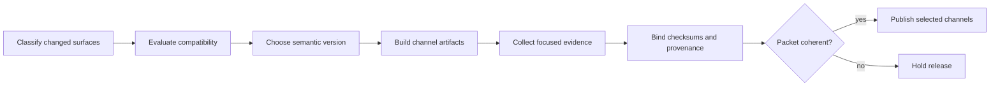

# Release and Versioning

An Atlas release is a compatibility decision, a set of built artifacts, and a
verifiable evidence packet tied to one source revision. Changing a number
without reconciling those three layers does not create a release.

## Release Decision Flow


```mermaid
flowchart LR
    Change[Classify changed surfaces] --> Compat[Evaluate compatibility]
    Compat --> Version[Choose semantic version]
    Version --> Build[Build channel artifacts]
    Build --> Evidence[Collect focused evidence]
    Evidence --> Bind[Bind checksums and provenance]
    Bind --> Verify{Packet coherent?}
    Verify -->|yes| Publish[Publish selected channels]
    Verify -->|no| Hold[Hold release]
```

## Version Authority

The root workspace version is inherited by the Atlas crates. Tags use semantic
versioning with a required `v` prefix; `rc`, `beta`, and `alpha` prerelease
identifiers are allowed. The chart has its own `version` and `appVersion`, and
release manifests repeat version identity for their owned artifacts.

Before a release, these values must tell one deliberate story. The current
checkout does not: the workspace is `0.2.2`, while the chart and several
checked-in release manifests remain at `0.2.0`. That is a release blocker, not a
documentation detail.

## Classify by Governed Surface

| Changed surface | Compatibility question | Required response |
| --- | --- | --- |
| Rust public API | Was a public item removed or changed incompatibly? | API snapshot, semantic-version check, migration guidance |
| CLI or HTTP contract | Did commands, routes, fields, errors, or defaults change? | contract diff, generated reference, consumer evidence |
| environment key | Was a key removed, renamed, or made required? | 180-day overlap, registry entry, docs, allowlist coverage |
| chart or profile key | Did type, safety default, or accepted alias change? | 180-day overlap, warning, schema and render evidence |
| report schema or check ID | Can automation still parse or invoke the old identity? | 180-day overlap and compatibility notice |
| documentation URL | Does the old public location still resolve? | redirect maintained for 365 days |
| internal implementation | Is every public and operational contract unchanged? | focused evidence; no invented user-facing impact |

The compatibility rules define breaking changes by surface. Do not reduce them
to one generic “major/minor/patch” judgment before identifying the owner and
consumer.

## Active Deprecations

The deprecation registry currently carries five chart-value migrations with a
removal target of `2026-09-01` and two documentation URL redirects with a
removal target of `2027-03-03`. Removal is admissible only after the recorded
target and after the required overlap, warning, redirect, communication, and
evidence obligations are satisfied.

A date alone does not remove a compatibility obligation. The release must show
that the replacement existed, consumers had the governed window, and the old
surface now fails or redirects exactly as policy requires.

## Maintainer Commands

Inspect the current release surface before generating or publishing anything:

```bash
cargo run -q -p bijux-atlas-dev -- release plan --format json
cargo run -q -p bijux-atlas-dev -- release version check --format json
cargo run -q -p bijux-atlas-dev -- release check --profile kind --format json
```

Then use the channel-specific `release crates`, `release images`, `release ops`,
manifest, checksums, signing, packet, and verification commands needed by the
selected release. A broad successful command does not replace a failed
channel-specific verifier.

## Evidence by Release Concern

| Concern | Evidence needed |
| --- | --- |
| source and version | immutable revision, clean inputs, workspace/chart/manifest agreement |
| compatibility | affected-surface diff, active deprecations, migration and negative tests |
| packages and OCI | built artifacts, registry checksums or digests, dependency closure |
| operations | chart render, profile policy, conformance, install, upgrade, rollback |
| performance and resilience | fresh named scenario runs with comparable baselines |
| provenance | checksums, signatures, SBOMs, builder and source attestations |
| publication | consumer retrieval and verification for each promoted channel |

## Workflow Semantics

`release-candidate.yml` collects useful reports, but several nonzero checks are
serialized as warning artifacts so the job can continue. Read the inner report
status and exit code; a green workflow shell is not sufficient evidence that
docs completeness, reproducibility, release checks, or operations readiness
passed.

Publication workflows also resolve enablement and matrices at runtime. A
workflow that resolves to no packages or skips publication is not proof that a
channel was published. Retain the resolved plan and published immutable
identifiers.

## Release Hold Conditions

Hold the release when any of these is true:

- version-bearing manifests disagree without an approved compatibility reason
- a required deprecation or redirect window is incomplete
- a required report is missing, stale, warning-only, or tied to another source
- checksums, provenance, or packet entries do not match distributed bytes
- a declared runner, artifact, or channel cannot be resolved
- consumer retrieval has not been verified

Urgency can shorten coordination, but it cannot turn missing evidence into a
pass. An emergency release should state which checks were completed, which were
deferred, why, and how the residual risk is contained.

## Authorities

- [version policy](https://github.com/bijux/bijux-atlas/blob/main/configs/sources/release/version-policy.json)
- [compatibility policy](https://github.com/bijux/bijux-atlas/blob/main/configs/sources/governance/governance/compatibility.yaml)
- [deprecation registry](https://github.com/bijux/bijux-atlas/blob/main/configs/sources/governance/governance/deprecations.yaml)
- [required status checks](https://github.com/bijux/bijux-atlas/blob/main/.github/required-status-checks.md)
- [release notes template](https://github.com/bijux/bijux-atlas/blob/main/.github/release-notes-template.md)
- [version manifests](../../bijux-atlas-ops/release/version-manifests.md)
