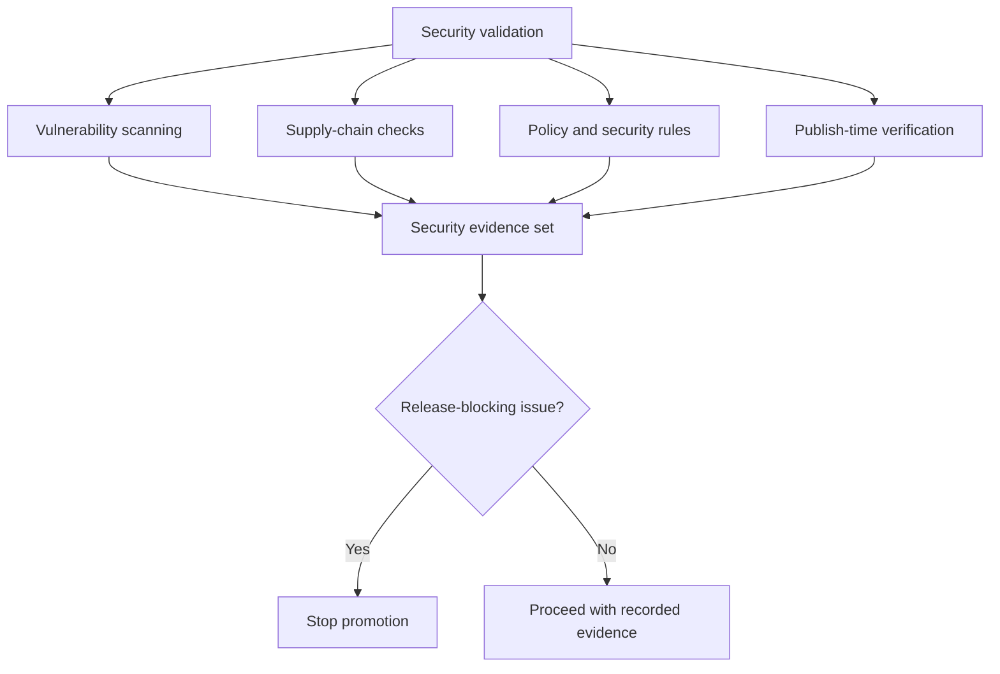

# Security Validation Lanes

Security workflows are split into supply chain, threat model, and data
protection validation lanes.

## Security Lane Model

This model helps maintainers read the security workflows as a coordinated set of
gates instead of a random list of CI files.

## Workflow Anchors

- [`.github/workflows/security-supply-chain-validation.yml`](/Users/bijan/bijux/bijux-atlas/.github/workflows/security-supply-chain-validation.yml:1)
- [`.github/workflows/security-threat-model-validation.yml`](/Users/bijan/bijux/bijux-atlas/.github/workflows/security-threat-model-validation.yml:1)
- [`.github/workflows/security-data-protection-validation.yml`](/Users/bijan/bijux/bijux-atlas/.github/workflows/security-data-protection-validation.yml:1)

## Main Takeaway

Security validation lanes are release-shaping evidence paths. They exist so
maintainers can separate dependency and supply-chain review, threat-model
governance, and publish-time security confidence instead of folding them into
one vague notion of "security checked."
