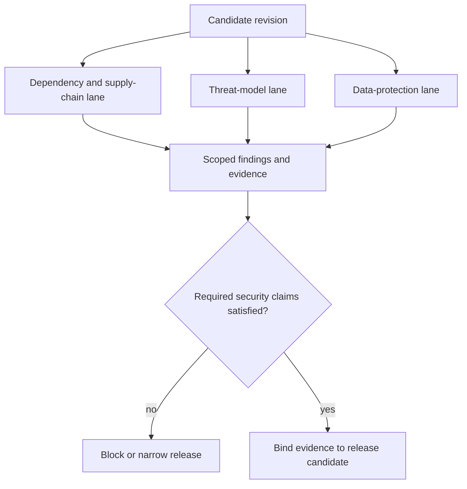
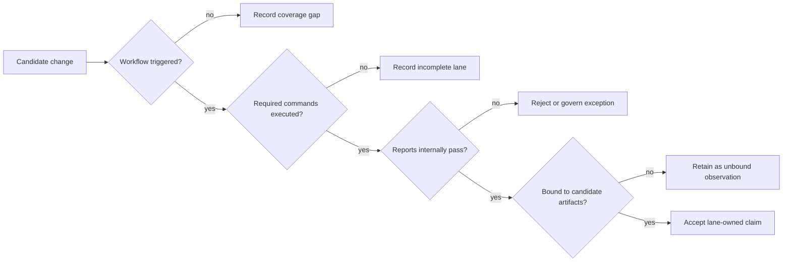

# Security Validation Lanes

Atlas separates supply-chain, threat-model, and data-protection validation so
their findings remain attributable. The lanes overlap in governance evidence
but protect different boundaries and have different trigger coverage.

## Lane Map

| Lane | Trigger | Primary evidence |
| --- | --- | --- |
| [supply chain](../../../.github/workflows/security-supply-chain-validation.yml) | every pull request and pushes to `main` | governance artifacts, security validation, dependency audit, and command contract test |
| [threat model](../../../.github/workflows/security-threat-model-validation.yml) | manual dispatch and selected threat-model, security implementation, CLI, or documentation paths | threat verification and governance contract tests |
| [data protection](../../../.github/workflows/security-data-protection-validation.yml) | every pull request and pushes to `main` | runtime data-protection contracts, governance evidence, and security control validation |

```mermaid
flowchart TD
    Candidate[Candidate revision] --> Supply[Dependency and supply-chain lane]
    Candidate --> Threat[Threat-model lane]
    Candidate --> Data[Data-protection lane]
    Supply --> Findings[Scoped findings and evidence]
    Threat --> Findings
    Data --> Findings
    Findings --> Decision{Required security claims satisfied?}
    Decision -->|no| Block[Block or narrow release]
    Decision -->|yes| Bind[Bind evidence to release candidate]
```

## Evidence Boundaries

Supply-chain validation covers repository governance artifacts, dependency
security commands, and their command contract. It does not by itself prove
image provenance, registry integrity, or deployment admission.

Threat-model validation checks the governed threat model and its implementation
contract. Its path filter currently references
`docs/04-operations/security-operations.md`, while the public security guide is
under `docs/bijux-atlas-ops/kubernetes/`. A documentation-only change in the
current public path may therefore not trigger this lane. Treat this as trigger
coverage risk, not evidence that the threat model is unaffected.

Data-protection validation exercises runtime protection contracts and broader
governance/security commands. It does not prove live secret delivery,
encryption infrastructure, external identity, or production data handling.

## Administrative Route Coverage Gap

None of the three workflows compares the complete server route-registration
set with `route_is_admin_endpoint`. The server currently registers 26 routes
when administrative endpoints are enabled, but the classifier recognizes only
18. Replica, recovery, failure-injection, and chaos routes fall through to the
ordinary dataset-read authorization class.

The supply-chain lane checks dependency and governance surfaces. The threat
lane verifies the threat-model control-plane command and its governance tests.
The data-protection lane runs runtime foundation contracts. Those are valuable
checks, but none establishes route-level parity in the server adapter. A green
conclusion from all three lanes must not be reported as proof that enabled
administrative routes are operator-only.

## Tolerated Commands and Artifacts

The supply-chain and data-protection workflows run several governance evidence
commands with `|| true`, then verify that expected files exist. File presence
does not establish an internally passing result. Review the generated statuses
and findings before accepting security evidence, and require downstream gates
to fail closed on invalid or failed content.

## Trigger, Execution, and Acceptance

```mermaid
flowchart LR
    Change[Candidate change] --> Trigger{Workflow triggered?}
    Trigger -- no --> Gap[Record coverage gap]
    Trigger -- yes --> Execute{Required commands executed?}
    Execute -- no --> Incomplete[Record incomplete lane]
    Execute -- yes --> Internal{Reports internally pass?}
    Internal -- no --> Reject[Reject or govern exception]
    Internal -- yes --> Bind{Bound to candidate artifacts?}
    Bind -- no --> Unbound[Retain as unbound observation]
    Bind -- yes --> Accept[Accept lane-owned claim]
```

A green workflow conclusion answers only the outermost automation question.
Security acceptance also requires expected trigger coverage, command execution,
internally passing reports, and binding to the exact candidate. Artifact upload
with `if: always()` preserves diagnostics; it does not convert failed content
into passing evidence.

## Coverage by Claim

| Release claim | Repository lane | Additional evidence outside the lane |
| --- | --- | --- |
| dependency and source policy | supply chain | released SBOM, artifact provenance, and consumer verification |
| threat controls match implementation | threat model | rendered exposure, live route tests, and incident detection |
| protected runtime data paths | data protection | live secret delivery, storage encryption, access audit, and retention |
| administrative routes are operator-only | no current lane provides complete coverage | registration-to-classifier parity plus authenticated positive and unauthorized negative tests for every enabled route |
| image admitted as intended | supply chain plus deployment policy | image digest, signature or ledger verification, and admission result |
| production exposure is safe | all applicable lanes | edge identity, network reachability, authorization, and workload evidence |

No repository lane observes the entire production trust boundary. Use lane
results as inputs to deployment security review, not as a replacement for it.

## Release Use

Bind each accepted report to the source revision, dependency lock state,
security policy, tool versions, and released artifact identities. Record lane
trigger, skipped coverage, exceptions, and unresolved findings. A combined
“security passed” claim is valid only when every security boundary required by
the release has direct evidence; absence of a triggered lane is not a pass.
