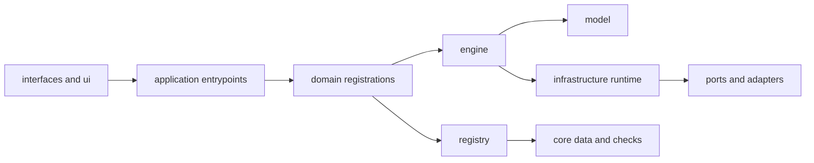
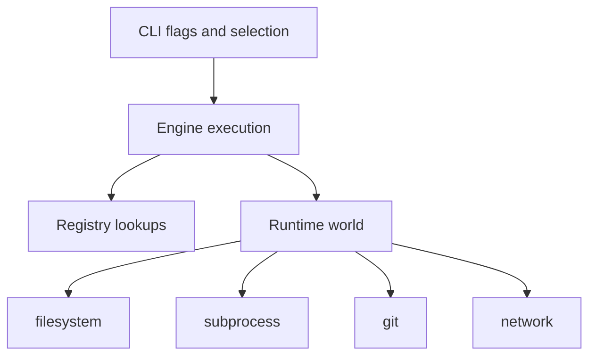

# Automation Architecture

This page explains how `bijux-dev-atlas` is organized as Atlas's development control plane.

## Architectural Zones

The intent is to keep command parsing, orchestration, registry lookup, and host effects in visibly separate places.

This architectural zone map explains why `bijux-dev-atlas` does not look like a pile of shell
wrappers. The control plane stays reviewable by giving command parsing, registry logic, execution,
and host effects different homes.

## Main Responsibilities

- `interfaces/cli` and `ui/terminal` expose command parsing and human-facing rendering
- `application/` wires command families such as docs, ops, configs, and control-plane flows
- `domains/` registers the durable extension surfaces: configs, docs, docker, governance, ops, perf, release, security, and tutorials
- `engine/` owns runnable selection, execution, rendering, and report encoding
- `registry/` owns registry loading, suite expansion, route validation, and report catalogs
- `model/` holds stable types, identifiers, and serialization-friendly shapes
- `infrastructure/runtime` owns filesystem, process, git, network, and workspace-root effects
- `ports/` defines the host-effect traits that the runtime implementations satisfy

## Effect Boundary

This effect boundary is the key design constraint for the control plane. Commands should describe
intent while the runtime world owns the actual host interactions.

The critical boundary is that host effects are mediated through the runtime world and its capability model instead of being scattered through command code.

## Extension Rules

When you add new automation behavior:

- prefer registering it through an existing or new domain instead of hard-coding it in a wrapper
- keep report schemas and runnable metadata in the registry-oriented surfaces
- treat `application/` as orchestration and dispatch, not as the place where validation rules live
- keep effectful behavior behind runtime adapters so selection, tests, and contracts can stay deterministic

## Why This Shape Matters

This structure lets Atlas keep one control plane for docs, governance, checks, suites, and report
validation without turning the crate into an unreviewable pile of scripts and special cases.

## Maintainer Shortcut

When you are unsure where new control-plane behavior belongs, ask whether you are adding interface,
orchestration, registry knowledge, execution logic, stable types, or host effects. That answer
usually points to the right zone immediately.

## Where to Go Next

- [System Overview](../../bijux-atlas/runtime/system-overview.md)
- [Contracts and Boundaries](../../bijux-atlas/contracts/contracts-and-boundaries.md)
- [Automation Control Plane](../automation/automation-control-plane.md)

## Purpose

This page explains the Atlas material for automation architecture and points readers to the canonical checked-in workflow or boundary for this topic.

## Stability

This page is part of the canonical Atlas docs spine. Keep it aligned with the current repository behavior and adjacent contract pages.
