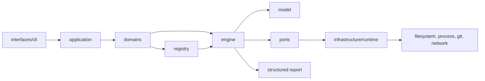
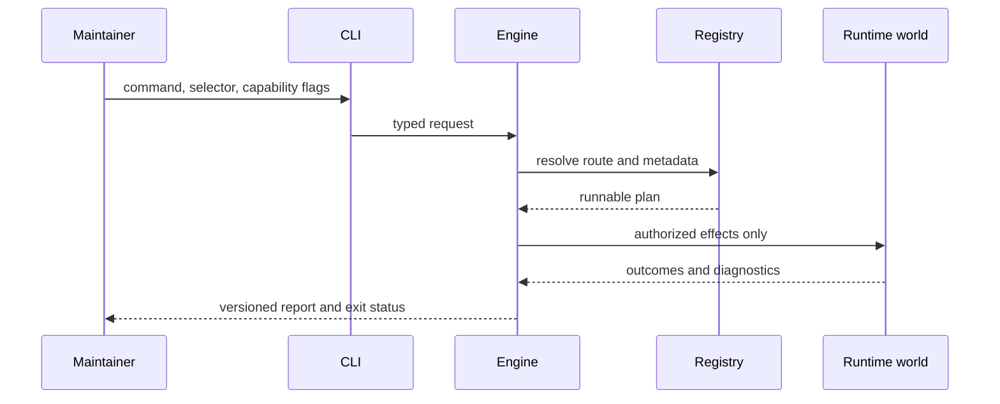

# Automation Architecture

`bijux-atlas-dev` is the repository-only Rust control plane for validation,
generation, operational orchestration, and evidence encoding. It turns a CLI
request into a typed route, resolves governed metadata, authorizes effects, and
returns a structured report.

```mermaid
flowchart LR
    CLI[interfaces/cli] --> App[application]
    App --> Domain[domains]
    Domain --> Registry[registry]
    Domain --> Engine[engine]
    Registry --> Engine
    Engine --> Model[model]
    Engine --> Ports[ports]
    Ports --> Runtime[infrastructure/runtime]
    Runtime --> Effects[filesystem, process, git, network]
    Engine --> Report[structured report]
```

## Ownership Zones

| Zone | Owns | Does not own |
| --- | --- | --- |
| `interfaces/cli` and `ui/terminal` | argument parsing and human rendering | repository policy or host effects |
| `application` | command-family dispatch and workflow composition | durable domain registration |
| `domains` | registered runnable definitions | direct terminal behavior |
| `registry` | registry loading, suite expansion, route validation, and report catalogs | executing subprocesses |
| `engine` | selection, execution coordination, rendering, and report encoding | concrete filesystem or network access |
| `model` and `core` | stable identifiers, serialized shapes, and reusable checks | orchestration |
| `ports` | traits for effects supplied by the host | concrete implementations |
| `infrastructure/runtime` | filesystem, process, git, network, and workspace-root effects | policy selection |

The zones are dependency boundaries, not merely directory labels. Command code
describes intent; the runtime world performs host interactions after capability
checks. Keeping that division visible makes dry execution, deterministic
selection, and structured failure reporting possible.

## Capability Flow

```mermaid
sequenceDiagram
    participant U as Maintainer
    participant C as CLI
    participant E as Engine
    participant R as Registry
    participant W as Runtime world
    U->>C: command, selector, capability flags
    C->>E: typed request
    E->>R: resolve route and metadata
    R-->>E: runnable plan
    E->>W: authorized effects only
    W-->>E: outcomes and diagnostics
    E-->>U: versioned report and exit status
```

Missing write, subprocess, network, or git authority must fail at the effect
boundary. A command must not silently acquire capability because a wrapper or
workflow invoked it.

## Extend the Control Plane

1. Put parsing and presentation in the interface layer.
2. Register durable behavior in the owning domain and registry.
3. Keep cross-domain sequencing in `application`.
4. Use the engine for selection and report production.
5. Add host interaction through a port and runtime adapter.
6. Define stable identifiers and serialized fields in model-owned surfaces.
7. Prove direct CLI, Make, and workflow routes select the same behavior when
   they claim parity.

The adjacent [Automation Control Plane](../automation/automation-control-plane.md)
describes the operator-facing command model, while
[Command Routing](../automation/command-routing.md) defines route identity and
effect parity.

## Failure Containment

| Failure | Owning boundary | Expected behavior |
| --- | --- | --- |
| unknown command or selector | CLI and registry | reject before domain execution |
| invalid governed input | owning domain validator | emit attributable findings without host mutation |
| missing capability | engine and runtime world | deny the effect and preserve a structured failure |
| external tool failure | runtime adapter | retain tool identity, exit status, and bounded output |
| report serialization failure | engine and model | fail the run rather than emit a success without evidence |
| wrapper parity failure | route integration | identify the diverging arguments, authority, output, or status |

Domain code should not catch an infrastructure failure and replace it with a
successful empty report. The report is the handoff contract; missing evidence
must remain missing or failed all the way to the process exit status.

## Compatibility Boundary

CLI flags, route identifiers, report schemas, and registry identifiers can be
consumed outside the crate and require compatibility review. Internal module
placement is an implementation detail only while moves preserve those observed
surfaces and the effect boundary.
