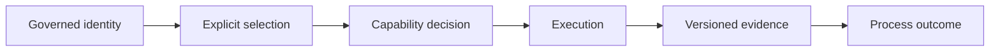

# Automation Contracts

The Atlas development control plane is a maintained interface for repository
work. Its contract covers discoverable command identity, explicit selection,
default-deny effects, structured run evidence, and versioned report families.
It does not give every internal command or JSON payload the same stability.

## Contract Layers

| Layer | Authority | Consumer may rely on |
| --- | --- | --- |
| command family | dev command registry plus matching Clap surface | documented family name and global invocation boundary. |
| check | check registry | stable check ID, owner, severity, mode, selectors, rationale, and declared evidence path. |
| suite | suite registry and suites index | suite ID, membership, execution metadata, and declared reports. |
| capability | effect declaration plus invocation flags | refusal unless filesystem write, subprocess, Git, or network access is granted. |
| report | report registry plus exact JSON Schema | registered identity, version, required shape, and additional-property policy. |
| run | emitted run result and process exit code | what was selected, granted, executed, skipped, passed, or failed in that run. |

Skipping a layer weakens the claim. Terminal text without run identity is not
run evidence. A report without its schema is not a stable parser target. A zero
exit code from a narrower selection is not evidence for its containing lane.

## Selection Contract

Automation must state what it intends to run. Check selection exposes suite,
domain, severity, mode, tag, name, and ID. Suite selection exposes suite, mode,
group, and tag. Slow and internal inclusion is explicit.

The result must make omitted and refused work distinguishable from passing
work. Consumers must inspect counts and selected IDs, not only the process exit
code. An empty selection must never be promoted into evidence that a domain is
healthy.

## Effect Contract

Read-only discovery and static checks run without effect grants. A command that
requires a subprocess, filesystem write, Git access, or network access must
receive its matching capability flag. Missing authority causes refusal rather
than silent downgrade.

Capability grants are part of run provenance. They say what the invocation was
allowed to do, not that every allowed effect occurred.

## Output Contract

Use the local `--format` accepted by the selected command or the supported
global `--output-format`. Do not assume all families share the same vocabulary:
ordinary commands commonly use `text`, `json`, or `jsonl`, while suite commands
use `human`, `json`, or `both`.

Machine consumers must bind to an exact command or report schema and combine
the payload with process exit status. Human wording, line order, color, help
layout, and debug diagnostics may change without a report-schema event.

## Report Compatibility

For a governed report family:

- `report_id` identifies the family;
- integer `version` identifies its schema version;
- the registry points to the exact schema and example location;
- the schema decides required fields, types, and whether additions are legal;
- breaking field removal, type change, or identity change follows the
  repository's 180-day report-schema deprecation window.

All five reports in the current public report registry set
`additionalProperties: false`. Adding a top-level field therefore requires a
coordinated schema change; tolerant-consumer advice does not override the
schema.

## Known Contract Gaps

Two current limitations narrow what maintainers can claim:

- the dev command registry and Clap surface disagree on `clients`, `contract`,
  `demo`, `packages`, and `migrations`;
- `reports validate` checks registered report identity and version, but does
  not validate the complete payload against its JSON Schema.

Treat mismatched command families as unavailable for stable automation. Treat a
passing report-directory scan as identity validation only. Use the owning
domain validator or an exact JSON Schema validator before making a payload
conformance claim.

## Compatible Change

A compatible automation change preserves the governing identity and semantics,
updates every coupled authority, and leaves existing consumers an explicit
overlap path where policy requires one. A command change coordinates the Clap
surface and command registry. A check rename coordinates the registry,
compatibility entry, suite membership, evidence mapping, and 180-day overlap.
A report change coordinates its producer, registry, schema, example, consumer,
and compatibility note.

Internal module layout, helper functions, scheduling implementation, and human
diagnostic prose may evolve when these external contracts remain intact.

See [Automation Command Surface](../automation/automation-command-surface.md)
for invocation details and [Automation Reports
Reference](../automation/automation-reports-reference.md) for validation depth.
