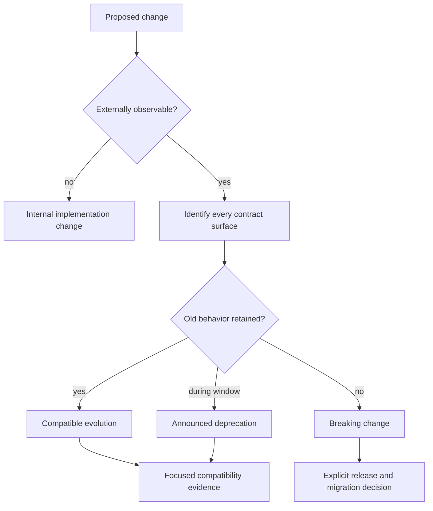

# Change and Compatibility

Compatibility is determined by what a consumer can observe, not by whether an
implementation diff looks like a refactor. Classify the affected surface before
choosing the implementation and release path.

## Observable Surfaces

- CLI commands, flags, exit codes, and structured output
- HTTP routes, request and response fields, OpenAPI shape, and error codes
- environment variables, runtime configuration, chart values, and profiles
- artifact layouts, manifests, report schemas, and check identifiers
- crate APIs, feature flags, binaries, and package ownership
- published documentation URLs and redirect behavior
- operational defaults, safety policy, and release-channel identities

Tests and documentation are evidence that a surface matters, but absence from
either does not make an observed behavior internal. Automation, operators, and
external clients can depend on behavior that lacks adequate coverage; that is a
documentation and test gap, not permission to break it silently.

## Classification Record

For each affected surface, record:

1. the owning crate, registry, schema, or workflow;
2. the previous and proposed observable behavior;
3. whether old and new forms coexist;
4. the governed deprecation window and removal target, when applicable;
5. focused evidence for both preserved and new behavior;
6. documentation, redirect, or migration guidance required for consumers.

The [Compatibility Matrix](../delivery/compatibility-matrix.md) defines concrete
rules for environment keys, chart values, profile keys, report schemas, check
identifiers, and documentation URLs. API and package surfaces carry their own
contract tests and versioning obligations in addition to that matrix.

## Automation Boundary

`bijux-atlas-dev audit readiness validate` checks that its audit bundle and
compliance report are successful and that a fixed set of readiness documents
exists. It does not interpret those documents, compare runtime behavior, or
prove backward compatibility. Compatibility still depends on surface-specific
tests, overlap evidence, and review of the actual consumer contract.

## Stability

An internal boundary remains freely changeable only while no supported client,
operator, workflow, or artifact observes it. Once a surface is published or
machine-consumed, its owning compatibility policy governs removal and rename
behavior.
