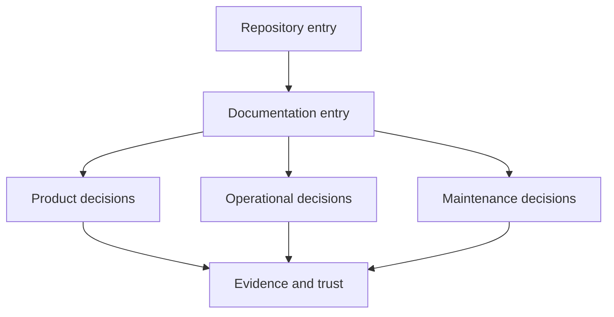

# Docs Spine Governance

The Atlas documentation spine connects four public entry points: repository,
product, operations, and maintenance. Each entry point owns a different first
decision. Keeping those decisions distinct prevents package inventories,
operator procedures, and maintainer policy from collapsing into one undirected
site.

## Spine Contract

| Entry point | First question answered | Required onward routes |
| --- | --- | --- |
| root `README.md` | What is Atlas, what ships, and what can be trusted? | installation, product model, operations, maintenance, release limits |
| `docs/index.md` | Which public handbook owns the reader's outcome? | product, operations, maintainer, evidence and trust |
| `docs/bijux-atlas/index.md` | How does a dataset become an immutable query release? | foundations, workflows, runtime, interfaces, contracts |
| `docs/bijux-atlas-ops/index.md` | How is a release admitted, observed, stressed, recovered, and promoted? | stack, Kubernetes, security, observability, load, release |
| `docs/bijux-atlas-dev/index.md` | How is a repository change governed and evidenced? | workspace, automation, governance, delivery, workflow ownership |



Navigation order communicates ownership. A page may link across handbooks when
a decision crosses boundaries, but it should remain under the handbook that
owns its primary contract.

## Add or Move a Page

1. Identify the reader decision and owning handbook before choosing a path.
2. Give the page one durable subject; avoid delivery chronology and catch-all
   categories.
3. Add it to `mkdocs.yml` beside adjacent decisions, not merely beside similar
   file names.
4. Link it from the owning index when it is a primary route.
5. If an existing public URL moves, add the old-to-new mapping to
   `configs/sources/repository/docs/redirects.json`.
6. Validate navigation and inspect both incoming and outgoing links.

Use a new page when the subject has independent authority, evidence, or failure
semantics. Extend an existing page when the material answers the same decision
and would otherwise force readers to reconstruct one contract across several
fragments.

## Spine Failure Modes

| Symptom | Why it damages trust | Corrective action |
| --- | --- | --- |
| page exists but is absent from navigation | public guidance becomes discoverable only by repository search | place it under its owning handbook and link it from the nearest decision route |
| identical introduction repeated across pages | readers cannot tell which page is authoritative | keep the overview at the index and move details to owned guides |
| maintainer process appears in product guidance | public behavior and repository procedure become indistinguishable | move procedure to the maintainer handbook and retain only the user-facing contract |
| moved URL has no redirect | bookmarks and external evidence references break | add a governed redirect before removing the old path |
| index lists nouns without decisions | navigation exposes inventory but not a route through it | state what question each destination answers and what proof it owns |

## Focused Verification

Run the navigation integrity check after every spine change:

```bash
cargo run --locked -p bijux-atlas-dev -- \
  docs nav-integrity --format json
```

The check establishes that configured navigation targets exist. It does not
prove that prose is accurate, redirects work after deployment, or cross-page
claims agree. Review those boundaries directly and use the strict preview path
when a change affects rendering or URL behavior.

Continue with [Redirects and Navigation](redirects-and-navigation.md) for URL
custody and [Documentation Standards](documentation-standards.md) for public
writing and evidence rules.
