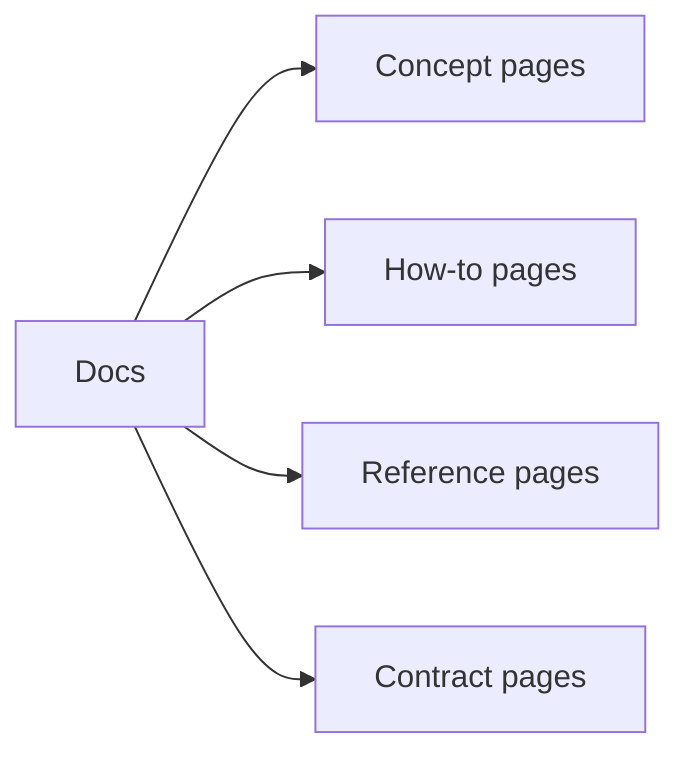
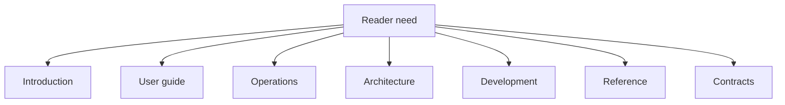
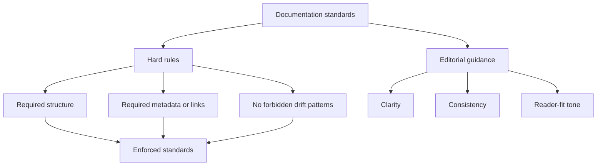

# Documentation Standards

Atlas documentation should make the right thing obvious and the wrong thing uncomfortable.

## Documentation Types

This documentation-type diagram helps authors choose the right kind of page before they start
writing. Atlas docs work better when readers do not have to infer whether a page is explanatory,
procedural, referential, or contractual.

## Placement Rules

This placement map is the reader-facing side of the docs architecture. It helps authors keep topics
in one canonical home instead of scattering them across convenient but redundant locations.

## Enforcement Model

This is the maintainer distinction that matters most. Some docs standards are repository rules that
should block or fail validation when violated, while others are editorial guidance that still
deserves review but does not belong in a brittle linter.

## Writing Rules

- one page should have one dominant purpose
- use diagrams when they clarify relationships or flow
- avoid mixing explanation, runbook, and contract language in one page
- prefer canonical paths and current ownership over historical naming
- prefer durable names over migration-era or time-boxed labels
- document the stable story, not accidental implementation trivia

## Source-of-Truth Rules

- one topic should have one canonical page in the reader-oriented spine
- reference material belongs in `07-reference`, not in ad hoc side directories
- generated artifacts may support docs, but they do not replace explanatory pages
- historical migration notes should either be absorbed into canonical docs or removed
- avoid archive-shaped duplication when the live docs already cover the behavior

## What Is Enforced Versus Reviewed

| Standard type | Typical source | How it is checked | Maintainer expectation |
| --- | --- | --- | --- |
| required docs placement, redirects, and spine integrity | docs governance rules and docs commands | docs validation and redirect sync checks | fix before merge |
| metadata, linkability, and generated reference alignment | authored docs plus generated inventories | docs build, docs reference checks, generated artifact validation | keep artifacts and authored pages aligned |
| PR-level docs obligations | [`.github/pull_request_template.md`](/Users/bijan/bijux/bijux-atlas/.github/pull_request_template.md:1) and docs-governance checklist | maintainer review plus CI | do not merge without the supporting evidence |
| clarity, pacing, diagram usefulness, and reader tone | canonical docs pages and reviewer judgment | editorial review | improve until the page teaches, not merely exists |

In practice, hard rules protect reader trust by preventing broken paths, drift, or fake sources of
truth. Editorial standards protect reader comprehension by making sure the surviving page is worth
reading.

## Repository Anchors

- [`.github/pull_request_template.md`](/Users/bijan/bijux/bijux-atlas/.github/pull_request_template.md:1) records the merge-time documentation obligations
- [`.github/CODEOWNERS`](/Users/bijan/bijux/bijux-atlas/.github/CODEOWNERS:1) records who owns docs boundaries
- [`docs/bijux-atlas-dev/governance/docs-spine-governance.md`](/Users/bijan/bijux/bijux-atlas/docs/bijux-atlas-dev/governance/docs-spine-governance.md:1) explains the curated reader spine
- docs validation and redirect commands under the maintainer automation surface are the enforcement path for structural drift

## Review Standard

Before merging docs, ask:

- is the reader path obvious?
- is the source of truth obvious?
- is the page in the right section?
- would a pedantic reviewer know what this page is for immediately?

## Documentation Smell Test

- does each diagram have prose that explains what the reader should take from it?
- can a returning maintainer understand the page without remembering old project history?
- is the page honest about what it knows and what it does not promise?

## Main Takeaway

Atlas documentation standards are not only writing advice. They are a mix of enforced repository
rules and reviewer judgment that together keep the docs spine navigable, truthful, and pleasant to
read for someone who did not live through the implementation history.

## Purpose

This page explains the Atlas material for documentation standards and points readers to the canonical checked-in workflow or boundary for this topic.

## Stability

This page is part of the canonical Atlas docs spine. Keep it aligned with the current repository behavior and adjacent contract pages.
