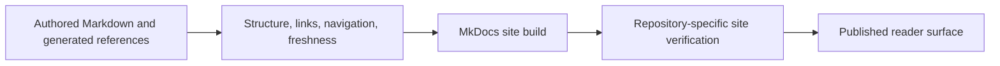

# Documentation Standards

Atlas documentation is a published product surface. Readers must be able to
distinguish implemented behavior from configured intent, measured evidence
from fixtures, and stable contracts from examples without knowing the
repository's delivery history.

## Publication Contract

```mermaid
flowchart LR
    Source[Authored Markdown and generated references] --> Validate[Structure, links, navigation, freshness]
    Validate --> Build[MkDocs site build]
    Build --> Verify[Repository-specific site verification]
    Verify --> Publish[Published reader surface]
```

Public pages use repository-relative reader links, durable domain terminology,
and current ownership. Local filesystem paths, editorial instructions,
placeholder prose, and claims unsupported by an executable source do not
belong in the published site.

## Authorities and Enforcement

| Authority | Governs | Verification surface |
| --- | --- | --- |
| `mkdocs.yml` and `mkdocs.shared.yml` | site composition, extensions, and navigation | MkDocs build |
| `configs/sources/repository/docs/quality-policy.json` | freshness, area budgets, naming, terminology, line length, headings, and asset roots | `bijux-atlas-dev docs validate` and related docs commands |
| `configs/sources/repository/docs/docs-spine.json` | principal entrypoints | spine validation |
| `configs/sources/repository/docs/redirects.json` | retained reader locations | redirect checks and synchronization |
| `configs/sources/repository/docs/generated-files-registry.json` | generated-reference ownership and generator command | generated-reference verification |
| `.github/CODEOWNERS` | review routing | GitHub review assignment; not proof of approval |

The `docs` command family exposes lint, links, navigation, inventory, graph,
duplicate, freshness, generated-reference, redirect, spine, build, and deploy
planning operations. Each command establishes only its named property. A
successful Markdown lint does not prove a site build, and a successful build
does not prove external links or the truth of an operational claim.

## Authoring Standard

- Lead with the reader's decision, procedure, or contract rather than the
  document's editorial purpose.
- Give one concept a canonical home and link to it instead of repeating prose.
- Use Mermaid when ownership, sequence, or state transitions are materially
  clearer as a visual.
- Name the authority and the evidence separately when configuration declares
  behavior that another command must execute.
- State limitations beside the claim they qualify.
- Keep generated reference material attributable to its source and generator.
- Preserve moved public URLs through the governed redirect map.

## Evidence Language

| Label or phrase | Meaning readers may rely on |
| --- | --- |
| declared | checked-in configuration expresses intent; execution is not implied |
| generated | a named generator produced the artifact from a stated source |
| validated | the named validator accepted the stated input and revision |
| simulated | the result comes from a controlled model or fixture, not a live environment |
| measured | a named scenario ran against an identified target and retained its observations |
| published | a channel operation completed and retained a receipt or immutable identity |

Avoid using “verified,” “production-ready,” or “conformant” without naming the
scope and retained evidence. Those words otherwise collapse several different
claims into one reassuring but unauditable sentence.

## Review Boundary

Automation protects structure, navigation, generated freshness, and other
machine-observable properties. Reviewers remain responsible for factual
accuracy, useful diagrams, coherent pacing, and whether limitations are clear.
Neither side substitutes for the other.

## Stability

Published URLs, generated-reference identities, report links, and documented
commands are compatibility surfaces. Editorial structure can evolve, but URL
moves follow the 365-day documentation compatibility window and require a
redirect entry.
