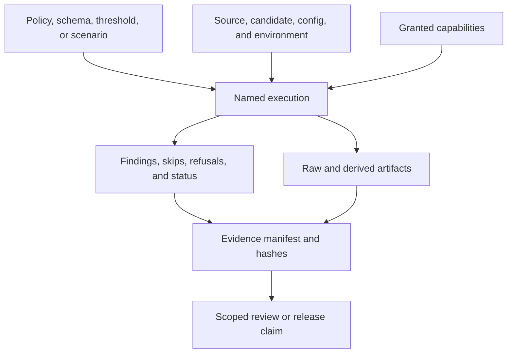

# Evidence Contracts

An evidence contract makes a validation result attributable, interpretable,
and durable. Stable filenames and JSON shape matter, but they are not enough:
the record must identify what ran, against which inputs, with which authority,
and what the result does and does not prove.

## Evidence Envelope

## Required Identity

| Field family | Required meaning |
| --- | --- |
| producer | command, binary/tool version, and report schema identity |
| source | repository revision and dirty-state context |
| selection | check, suite, profile, scenario, dataset, or contract IDs |
| inputs | effective configuration, policy, thresholds, and candidate identity |
| environment | platform and external dependency identity relevant to the result |
| capability | filesystem, subprocess, network, or cluster authority granted or refused |
| execution | run ID, start/end time, status, and process outcome |
| findings | stable codes, severity, ownership, and affected paths or resources |
| artifacts | governed paths, content hashes, redaction state, and derivation links |
| limits | skipped work, unavailable evidence, unsupported scope, and residual risk |

Not every report serializes every family in one object. The evidence bundle
must still make the relationships recoverable without relying on a terminal
transcript or the operator's memory.

## Status Semantics

| Status | Interpretation |
| --- | --- |
| pass | selected work completed and satisfied its exact criteria |
| fail | selected work completed and found a governed violation |
| incomplete | execution ended without all required evidence |
| refused | a required capability was not granted |
| skipped | selection or environment excluded named work |
| blocked | a prerequisite prevented the selected work from completing |
| invalid | evidence cannot be parsed, validated, attributed, or trusted |

A top-level `ok` or `pass` cannot erase failed sections, missing required
assets, or refused external work. Aggregation rules must be explicit and
fail closed for evidence required by the claim.

## Custody and Derivation

Raw producer output should be retained when evidence supports a release,
security, compatibility, or incident decision. Redaction, normalization,
aggregation, and summarization create derived artifacts. Record their inputs,
transform, tool version, and hashes so reviewers can trace a summary back to
the captured result.

Never repair a failed or malformed report in place. Preserve it, correct the
producer or inputs, and create a new run identity. Failed and partial evidence
is part of the reliability record.

## Validation Depth

Schema validation proves shape. Semantic validation checks cross-field and
referenced identities. Execution validation proves the named operation ran.
Artifact binding connects the result to released bytes. State the deepest
completed level in review; do not summarize all four as “validated.”

See [Testing and Evidence](testing-and-evidence.md) for claim selection and
[Automation Reports Reference](../automation/automation-reports-reference.md)
for the control plane's concrete report families.
