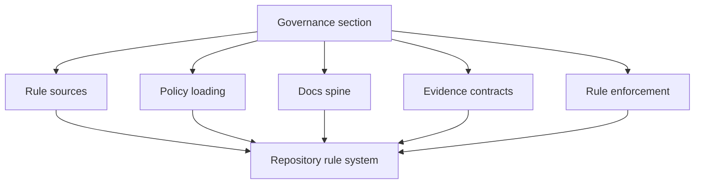

# Governance

`bijux-atlas-dev/governance` is the section home for this handbook slice.

Governance is the part of the maintainer handbook that explains how repository
rules become real behavior. It owns the connection between documented doctrine,
checked-in policy sources, evidence quality, and the enforcement path that makes
those rules more than aspirations.

## What Governance Owns In This Repo

- rule and doctrine sources under `configs/sources/governance/governance/`
- policy inputs under `configs/sources/governance/policy/`
- docs spine and navigation integrity across the handbook trees
- evidence expectations that support review, release, and policy decisions
- automation enforcement paths that turn rules into checks or reports

## Pages

- [Automation Architecture](automation-architecture.md)
- [Automation Contracts](automation-contracts.md)
- [Change and Compatibility](change-and-compatibility.md)
- [Docs Spine Governance](docs-spine-governance.md)
- [Documentation Standards](documentation-standards.md)
- [Evidence Contracts](evidence-contracts.md)
- [Policy Loading](policy-loading.md)
- [Redirects and Navigation](redirects-and-navigation.md)
- [Rule Enforcement](rule-enforcement.md)
- [Testing and Evidence](testing-and-evidence.md)
