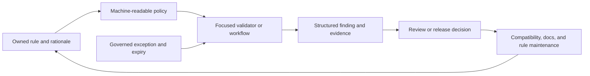

# Governance

Atlas governance turns owned rules into inspectable policy, focused
enforcement, and evidence that can support review. A rule is durable when its
authority, scope, owner, enforcement path, exception model, and failure result
are explicit.

```mermaid
flowchart LR
    Doctrine[Owned rule and rationale] --> Policy[Machine-readable policy]
    Policy --> Enforce[Focused validator or workflow]
    Enforce --> Report[Structured finding and evidence]
    Report --> Decision[Review or release decision]
    Exception[Governed exception and expiry] --> Enforce
    Decision --> Feedback[Compatibility, docs, and rule maintenance]
    Feedback --> Doctrine
```

## Governed Surfaces

| Surface | Authority | Maintainer concern |
| --- | --- | --- |
| repository rules | `configs/sources/governance/governance/` | ownership, naming, boundaries, and durable invariants |
| policy inputs | `configs/sources/governance/policy/` | loading, precedence, validation, and fail-closed behavior |
| documentation spine | navigation, metadata, redirects, and docs contracts | public discoverability and reader-facing truth |
| compatibility | API, CLI, configuration, artifact, and ownership policy | additive, deprecating, migrating, or breaking change |
| evidence | schemas, run identity, findings, status, and artifact binding | what a result establishes and what remains unproven |
| enforcement | control-plane commands and workflows | deterministic selection, capabilities, and failure routing |

## Route by Decision

- [Rule Enforcement](rule-enforcement.md) traces a rule from source to finding.
- [Policy Loading](policy-loading.md) defines policy discovery and precedence.
- [Automation Contracts](automation-contracts.md) and
  [Automation Architecture](automation-architecture.md) define command and
  implementation boundaries.
- [Change and Compatibility](change-and-compatibility.md) classifies consumer
  impact.
- [Evidence Contracts](evidence-contracts.md) defines report identity and
  custody.
- [Testing and Evidence](testing-and-evidence.md) matches validation cost and
  depth to the claim.
- [Docs Spine Governance](docs-spine-governance.md),
  [Documentation Standards](documentation-standards.md), and
  [Redirects and Navigation](redirects-and-navigation.md) govern public
  documentation integrity.

## Governance Failure Modes

- A narrative rule with no enforcement path is guidance, not an automated gate.
- A validator with no owned policy can hard-code accidental behavior.
- A passing report without source and input identity cannot support review.
- A skipped or refused check is missing evidence, not conformance.
- An exception without scope, owner, compensating control, and expiry becomes
  an undocumented permanent rule change.
- A generated reference that drifts from its authority is a governance defect
  even when both files remain syntactically valid.

Governance should make disagreement visible. It must not hide missing coverage
behind a broad status label or force unrelated surfaces through one generic
validation path.
