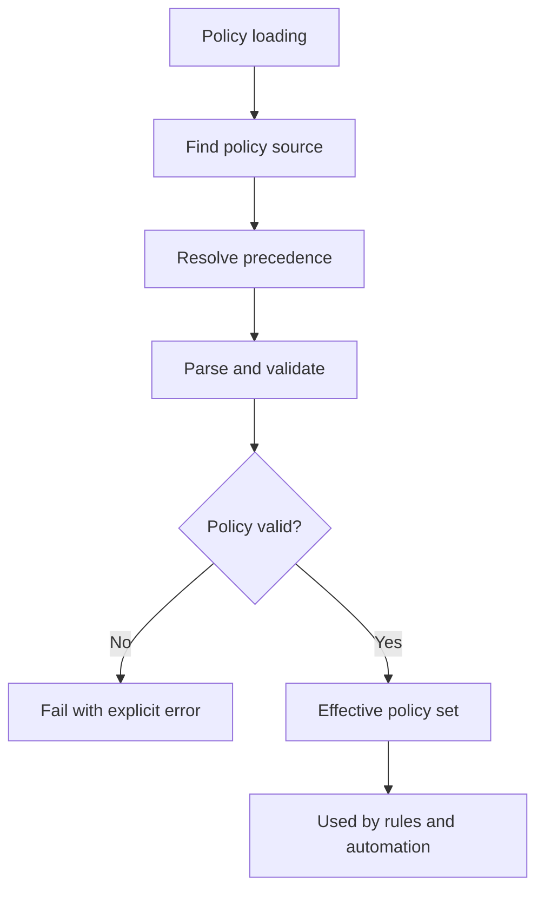

# Policy Loading

Policy loading belongs in the control plane so repository checks and runtime
ops share the same declared rules.

## Policy Loading Model

This model is important because policy loading is where governance stops being a
pile of files and becomes the effective rule set a command or check actually
uses.

## Repository Anchors

- governance sources live under [`configs/sources/governance/`](/Users/bijan/bijux/bijux-atlas/configs/sources/governance)
- governance state and exception loading are handled in [`src/application/governance.rs`](/Users/bijan/bijux/bijux-atlas/crates/bijux-dev-atlas/src/application/governance.rs:354)
- control-plane policy rendering is wired in [`src/application/control_plane.rs`](/Users/bijan/bijux/bijux-atlas/crates/bijux-dev-atlas/src/application/control_plane.rs:82)
- the dev-atlas policy loader and validator live in [`src/policies/`](/Users/bijan/bijux/bijux-atlas/crates/bijux-dev-atlas/src/policies)

## Main Takeaway

Policy loading is the bridge between authored rule files and actual
enforcement. If the control plane cannot find, validate, and render the
effective policy set clearly, maintainers lose the ability to trust the checks
that follow.
