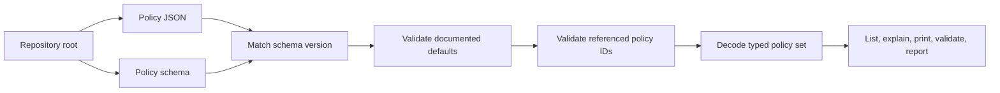

# Policy Loading

Atlas has several governance source trees, but the `policies` command family
loads one specific development-policy document. Its fixed authorities are:

- `ops/inventory/policies/dev-atlas-policy.json`, the policy instance; and
- `ops/inventory/policies/dev-atlas-policy.schema.json`, the schema authority.

There is no search path, environment override, or layered precedence for this
policy set. `--repo-root` selects the repository; the two paths beneath that
root are fixed. A missing or malformed file is an error.

## Load Boundary


```mermaid
flowchart LR
    Root[Repository root] --> Config[Policy JSON]
    Root --> Schema[Policy schema]
    Config --> Version[Match schema version]
    Schema --> Version
    Version --> Defaults[Validate documented defaults]
    Defaults --> Registry[Validate referenced policy IDs]
    Registry --> Decode[Decode typed policy set]
    Decode --> Commands[List, explain, print, validate, report]
```

Loading verifies the schema-version declaration, documented-default entries,
registered IDs used by defaults, ratchets, and relaxations, and typed decoding
with unknown fields denied. It does **not** perform full JSON Schema validation.
The schema file contributes its version constant during this path; consumers
must not interpret `policies validate` as proof that every schema constraint was
evaluated.

## Effective Policy Set

The current document declares four exposed groups:

| Group | Contents | Current enforcement depth |
| --- | --- | --- |
| `repo` | size, depth, module-count, file-count, and allowlist settings | pure evaluation implements `max_loc_hard` |
| `ops` | canonical registry path | pure evaluation checks that the configured path exists |
| `compatibility` | allowed transitions among `dev`, `ci`, and `strict` | loaded and reported; not evaluated by the pure policy evaluator |
| `documented_defaults` | reasons for selected defaulted fields | validated for identity and non-empty rationale |

Ratchets and relaxations are also represented by the typed model. The pure
evaluator recognizes relaxations for its two implemented policy IDs. It does
not check relaxation expiry while loading or evaluating: an expiry validator
exists in the library, but the `policies` command path does not call it. Until
that wiring exists, expiry must be validated by the owning governance workflow
before a relaxation is treated as current.

## Inspect the Loaded Policy

```bash
bijux-atlas-dev policies validate --repo-root . --format json
bijux-atlas-dev policies list --repo-root . --format json
bijux-atlas-dev policies explain repo --repo-root . --format json
bijux-atlas-dev policies print --repo-root . --format json
```

`list` and `explain` are inspection commands. `report` confirms that the typed
policy set loaded and reports four inventory groups; it is not an enforcement
report. To claim repository-policy conformance, pair policy validation with the
specific check that evaluates the relevant field and retain both outputs.

## Change Discipline

The library exposes a comparison that rejects changed policy content without a
schema-version bump. Loading a single document does not compare it with a prior
revision, so that compatibility rule only applies where a caller supplies both
versions. A policy change therefore needs an explicit review of the schema,
typed model, evaluator coverage, command output, and affected consumers.

Policy presence, policy validity, and policy enforcement are separate claims.
Atlas makes the first two inspectable; only a named evaluator can establish the
third.
