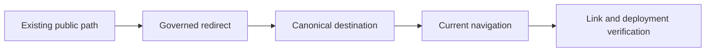

# Redirects and Navigation

Navigation defines current discovery; redirects preserve historical discovery.
They are separate contracts. A page can appear correctly in the current site
while old bookmarks, release evidence, or external citations still fail.

## Authorities

| Authority | Owns | Must not be used for |
| --- | --- | --- |
| `mkdocs.yml` | current hierarchy, labels, and ordered public routes | preserving an old URL after a move |
| `configs/sources/repository/docs/redirects.json` | exact source-to-destination path mappings | creating alternate navigation hierarchies |
| Markdown links | contextual movement between decisions | replacing primary navigation or redirect coverage |

The redirect registry currently preserves the former numbered product,
operations, architecture, development, reference, and contract paths. Its
destinations use repository-relative Markdown paths so they remain reviewable
against the source tree.

## Move Contract

A move is complete only when:

- the destination has the same or deliberately superseding meaning;
- `mkdocs.yml` exposes the new canonical route;
- every source link under repository control uses the canonical path;
- the redirect registry maps the former path directly to the destination;
- redirect and destination do not form a loop or chain; and
- deployed-site verification confirms the old URL resolves as intended.

Do not reuse an old URL for a different concept. A redirect is a compatibility
commitment, not a convenience alias.

## Collision and Chain Rules

| Condition | Required response |
| --- | --- |
| two old paths converge on one canonical guide | keep two explicit mappings when both meanings remain represented |
| one old page splits into several new guides | redirect to the closest stable overview and add contextual onward routes there |
| destination moves again | update every historical source directly to the newest canonical destination |
| source path exists as a live page | choose one authority; do not serve a page and redirect from the same identity |
| destination is removed | provide a durable replacement before changing the mapping |

Direct mappings keep resolution deterministic and make a deleted intermediate
page irrelevant. Redirect chains create unnecessary deployment dependencies
and make compatibility harder to audit.

## Review Procedure

1. Record the old path before moving content.
2. Move by reader decision and durable ownership, not by a new numbering scheme.
3. Update navigation and repository links to the canonical destination.
4. Add or revise the redirect mapping.
5. Parse the registry, verify every destination exists, and reject cycles.
6. Build or preview the site when the redirect mechanism or URL shape changes.
7. Retain the redirect through the compatibility window defined by the
   [Compatibility Matrix](../delivery/compatibility-matrix.md).

Navigation integrity proves that current targets exist. Redirect verification
must additionally exercise historical source paths. Neither check establishes
that the destination preserves the old page's meaning; that remains a review
responsibility.
