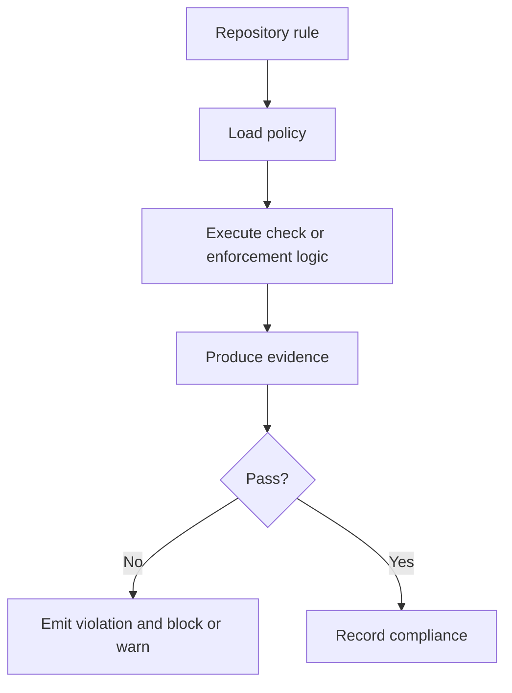

# Rule Enforcement

Rule enforcement turns repository law, policy data, and generated evidence into
actionable pass or fail decisions.

## Enforcement Model

This page should teach maintainers that enforcement is not only the final
message. It is the full chain from rule source, to loaded policy, to executed
logic, to evidence output, to a blocking or advisory decision.

## Repository Anchors

- enforcement rule sources live under [`configs/sources/governance/governance/enforcement/`](/Users/bijan/bijux/bijux-atlas/configs/sources/governance/governance/enforcement)
- the governance enforcement reference code lives in [`src/reference/governance_enforcement.rs`](/Users/bijan/bijux/bijux-atlas/crates/bijux-dev-atlas/src/reference/governance_enforcement.rs:1)
- governance and control-plane application logic consume those rule sets through the maintainer automation surface

## Main Takeaway

Rule enforcement is where Atlas governance becomes operational. The rule source,
the policy-loading path, the evidence artifact, and the final pass-or-fail
decision all need to stay visible or the repository starts enforcing things no
one can properly explain.
