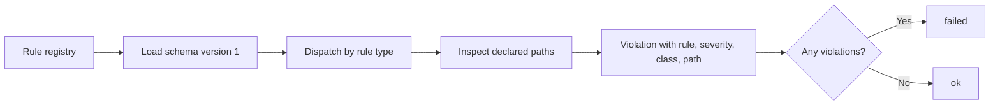

# Rule Enforcement

The governance rule registry gives Atlas a deterministic, repository-local set
of structural checks. The authority is
`configs/sources/governance/governance/enforcement/rules.json`; the evaluator is
implemented in `bijux-atlas-dev` and returns a versioned result containing the
rule count, status, and violations.


```mermaid
flowchart LR
    Registry[Rule registry] --> Load[Load schema version 1]
    Load --> Dispatch[Dispatch by rule type]
    Dispatch --> Inspect[Inspect declared paths]
    Inspect --> Finding[Violation with rule, severity, class, path]
    Finding --> Status{Any violations?}
    Status -- Yes --> Failed[failed]
    Status -- No --> OK[ok]
```

## Current Coverage

The registry currently declares 12 rules across repository, documentation,
registry, and deployment classifications.

| Rule type | What the evaluator establishes |
| --- | --- |
| required or prohibited paths | each declared path exists or is absent |
| repository layout | the layout contract has schema version 1 and each required directory exists |
| documentation front matter | Markdown under the declared roots begins with a front-matter block |
| contract, check, and scenario registries | the JSON parses and the named top-level array exists and is non-empty |
| operations artifact registry | `render_outputs` exists and is non-empty |
| release artifact registry | a schema version and at least one recognized release-asset section exist |
| documentation navigation | `mkdocs.yml` parses and its top-level `nav` sequence is non-empty |

These are deliberately bounded structural checks. They do not prove that every
registry entry conforms to its JSON Schema, that every navigation target
exists, that front matter contains every required field, or that deployment and
release artifacts are operationally correct. Use the owning domain validator
for those stronger claims.

## Run and Interpret

```bash
bijux-atlas-dev governance rules --repo-root . --format json
bijux-atlas-dev governance check --repo-root . --format json
```

`governance rules` exposes the registered rule set. `governance check` runs the
evaluator. A result with `status: "ok"` means that all 12 registered structural
checks passed for that repository snapshot. It does not summarize every Atlas
governance command or every policy source.

Each violation carries the stable rule ID, declared severity and
classification, a message, and—when applicable—the repository-relative path.
Automation should route on the structured fields and process exit status, not
terminal prose.

## Authority and Failure Semantics

- Failure to read or parse the registry prevents evaluation.
- A registry schema version other than `1` is rejected.
- Read and parse failures for a declared artifact become rule violations.
- Missing documentation roots in the front-matter rule are currently skipped,
  so path existence must be covered by a separate required-path rule when it is
  mandatory.
- The evaluator uses the registry's severity as evidence metadata; the overall
  result fails on any violation regardless of severity.

A new rule type requires coordinated changes to the registry schema, typed
enum, evaluator, fixtures, and public coverage table. Adding only a JSON row is
not enough when the executable does not understand its `rule_type`.

Rule enforcement is trustworthy when its claim is no broader than its actual
inspection. Atlas exposes the selected rules and their findings so reviewers
can distinguish structural evidence from deeper semantic or operational
validation.
