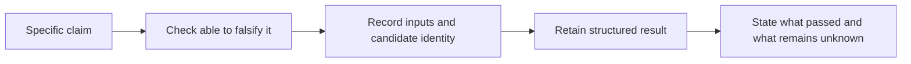

# Testing and Evidence

Atlas validation is a claim-matching exercise. Choose the smallest check that
can disprove the claim, then broaden only when the affected boundary or review
path requires stronger integration evidence.

## Match Proof to Claim

| Claim | Suitable evidence | Insufficient by itself |
| --- | --- | --- |
| a docs page is structurally valid | focused docs validation with zero errors and warnings. | visual inspection of Markdown source. |
| a Rust function preserves behavior | named unit or package test exercising the changed path. | successful compilation. |
| a public command is compatible | command test, registry agreement, governed output validation, and compatibility review. | one successful manual invocation. |
| a report conforms | exact JSON Schema validation of producer output plus report identity and version. | `reports validate` identity scan alone. |
| an artifact is reproducible | independent builds with identical governed inputs and matching digests. | rebuilding once in the same directory. |
| a deployment profile is safe | rendered-profile validation plus security, health, and load evidence for the candidate. | a successful Helm render. |
| rollback is ready | exercised rollback with integrity, health, and data-selection evidence. | the presence of a rollback command or old image tag. |



## Evidence Strength

Evidence becomes stronger as it gains scope identity, contract validation, and
independence:

1. an observed command result shows current behavior;
2. a focused test exercises a named implementation boundary;
3. a contract check compares behavior or data with its authority;
4. a containing suite tests interactions and emits run-scoped reports;
5. an independent environment or rebuild challenges hidden local state;
6. retained release evidence binds the result to the candidate under review.

Higher levels do not make lower levels obsolete. A broad lane may report a
failure without the detail supplied by the focused check. Preserve both.

## Select Without Overspending

Start with discovery:

```bash
bijux dev atlas check list --domain <domain> --format json
bijux dev atlas check explain <check-id> --format json
bijux dev atlas suites describe --suite <suite> --format json
```

Then run the focused selector. Use full workspace, all-feature, slow,
network-dependent, load, or nightly lanes only when the changed surface or
release decision needs them. Their cost is justified by broader risk, not by
habit.

For documentation changes, `docs validate` is the baseline. Build or UX smoke
is appropriate when rendering behavior, generated references, assets, includes,
or navigation execution changes. Product and operations suites are not evidence
for a prose-only edit unless the edit changes a governed generated input.

## Record Run Identity

Evidence used for review should retain:

- repository revision and dirty-state context;
- binary or tool version;
- selected check, suite, profile, scenario, or dataset IDs;
- relevant configuration and environment identity, with secrets redacted;
- granted capabilities;
- run ID and artifact root;
- process outcome and structured report path;
- skipped, refused, or unavailable work.

Time, throughput, memory, and latency results also need hardware, concurrency,
dataset, cache state, duration, and warmup identity. Without that context, two
numbers are not comparable performance evidence.

## Interpret Failure Honestly

Distinguish these outcomes:

| Outcome | Meaning |
| --- | --- |
| pass | the exact selected validation completed and met its criteria. |
| fail | the selected validation completed and found a violation. |
| refused | required capability was not granted; the work did not run. |
| skipped | selection or environment excluded work; it did not pass. |
| blocked | a named prerequisite prevented completion. |
| invalid evidence | output is truncated, unversioned, schema-invalid, or detached from candidate identity. |

Do not convert refused, skipped, blocked, or invalid evidence into a pass.
Report the exact boundary and the rerun command needed to obtain valid proof.

## Review Statement

A precise handoff says: “`docs validate` completed with zero errors and warnings
on this revision; rendered-site build and broad test lanes were not run because
the change touched reader prose only.” That statement is more useful than
“tests pass” because it preserves both evidence and limits.

See [Automation Reports Reference](../automation/automation-reports-reference.md)
for report validation depth and [Contributor
Workflow](../workspace/contributor-workflow.md) for commit and review discipline.
