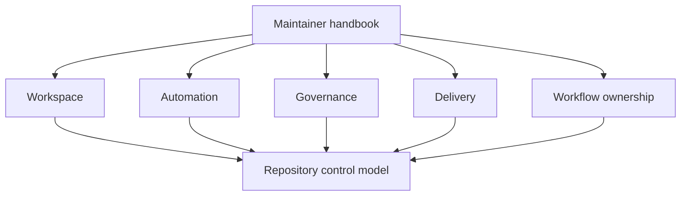

# bijux-atlas-dev

`bijux-atlas-dev` is the maintainer control-plane handbook.

This handbook should let a maintainer move from a repository question to the
right authority surface without guesswork. Its job is to explain how the repo is
operated as a control plane: which tools initiate change, which rules govern
it, which evidence proves it, and who owns the decision path.

## Scope

Use this handbook for workspace ownership, automation surfaces, governance,
delivery lanes, and workflow ownership.

## Maintainer Authority Map

- workspace structure and contributor-facing repository law:
  `docs/bijux-atlas-dev/workspace/*`
- automation behavior and direct control-plane implementation:
  `crates/bijux-dev-atlas/` and `make` wrappers in `makes/`
- governance rules and policy sources:
  `configs/sources/governance/`
- delivery behavior and publication lanes:
  `.github/workflows/`, release configs, and related release metadata
- review routing and template-driven workflow ownership:
  `.github/CODEOWNERS`, `.github/PULL_REQUEST_TEMPLATE*`, and
  `.github/ISSUE_TEMPLATE/`

## Main Takeaway

`bijux-atlas-dev` is not background reading. It is the documentation layer for
the maintainer control plane. A good maintainer page should help answer four
questions quickly: who owns this, what rule applies, what command or workflow
starts it, and what evidence closes it.

## Sections

- [Workspace](workspace/index.md)
- [Automation](automation/index.md)
- [Governance](governance/index.md)
- [Delivery](delivery/index.md)
- [Workflow Ownership](workflow-ownership/index.md)
