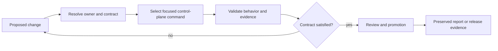

# Atlas Maintainer Overview

Atlas is maintained through a repository control plane, not a collection of
unrelated scripts. `bijux-atlas-dev` gives maintainers and CI one command model
for documentation, configuration, governance, operations, security, load, and
release evidence.

It is repository-only infrastructure. Product behavior remains in the Atlas
runtime crates; reusable operational models remain in `bijux-atlas-ops`.

## The Maintainer Trust Loop


```mermaid
flowchart LR
    C["Proposed change"] --> O["Resolve owner and contract"]
    O --> P["Select focused control-plane command"]
    P --> V["Validate behavior and evidence"]
    V --> D{"Contract satisfied?"}
    D -->|no| C
    D -->|yes| R["Review and promotion"]
    R --> E["Preserved report or release evidence"]
```

The loop starts with ownership. A values change is evaluated as Kubernetes
configuration; an API change is evaluated against compatibility contracts; a
load change is evaluated against a named scenario and baseline. The command is
chosen after the contract, not before it.

## Control-Plane Entry Points

The direct checkout command is:

```bash
cargo run -p bijux-atlas-dev -- --repo-root "$PWD" --help
```

Installed Bijux environments expose the same surface under:

```bash
bijux dev atlas --help
```

| Question | Start here |
| --- | --- |
| What commands, checks, or reports exist? | `list`, `describe`, `registry`, `reports` |
| Is the documentation coherent? | `docs validate`, `docs links`, `docs nav-integrity` |
| Are repository policies satisfied? | `governance`, `policies`, `invariants`, `check` |
| What would an operational action do? | `ops plan`, `ops describe`, profile and scenario commands |
| Is a deployment shape valid? | `ops render`, `ops validate`, `ops conformance` |
| Has performance changed? | `load baseline`, `load run`, `load compare` |
| Is the release packet coherent? | `release`, `ops evidence`, and verification commands |

Run the relevant command's `--help` before granting write, network, subprocess,
or cluster access. Read-only inspection should remain read-only.

## Evidence Is an Interface

Control-plane commands emit deterministic human or JSON output. Reports carry
the run identity, inputs, findings, status, and owned artifact paths needed by
CI and reviewers. A missing required metric, report, schema, or capability is a
failed or incomplete run—not a successful empty result.

Stable integrations should consume documented commands, registries, schemas,
and report fields. Internal Rust module paths and terminal presentation are not
automation contracts.

## Working by Risk

- For a documentation-only change, validate structure, navigation, links, and
  rendering without invoking product or cluster suites.
- For a policy or schema change, validate the owning contract and every
  generated consumer affected by it.
- For an operations change, render first, inspect the plan, then run only the
  profile and conformance evidence needed for that deployment shape.
- For a release decision, require the source identity, governed artifacts,
  checksums, provenance, and verification report to agree.

Broad suites are useful before promotion, but they do not replace focused proof
of the changed contract.

## Handbook Routes

- [Workspace](workspace/index.md) — repository layout, generated assets, local
  development, and contribution boundaries
- [Automation](automation/index.md) — commands, execution, reports, and
  capability controls
- [Governance](governance/index.md) — policies, invariants, compatibility, and
  evidence contracts
- [Delivery](delivery/index.md) — CI, publication, security lanes, and release
  readiness
- [Workflow Ownership](workflow-ownership/index.md) — review routing, required
  checks, and operational workflow entry points

For production operation rather than repository maintenance, continue to the
[Atlas operations handbook](../bijux-atlas-ops/index.md).
