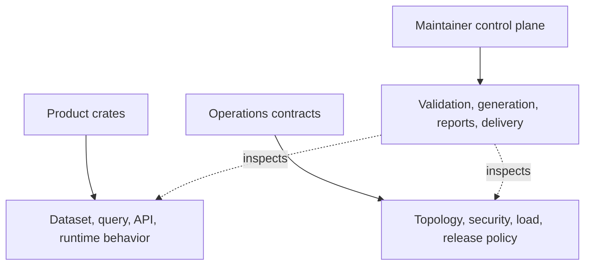
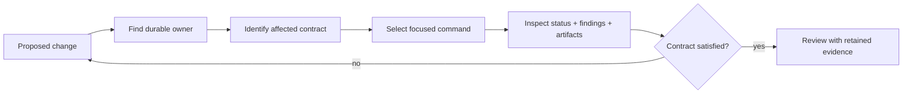

# Atlas maintainer handbook

`bijux-atlas-dev` is the repository control plane used by maintainers and CI.
It discovers owned contracts, validates explicit inputs, gates effects, and
emits structured reports for documentation, governance, operations, security,
load, and release work. It is repository infrastructure, not a runtime
dependency or an alternate implementation of product behavior.

## Ownership direction


```mermaid
flowchart TB
    Product[Product crates] --> Behavior[Dataset, query, API, runtime behavior]
    Ops[Operations contracts] --> Policy[Topology, security, load, release policy]
    Dev[Maintainer control plane] --> Evidence[Validation, generation, reports, delivery]
    Evidence -. inspects .-> Behavior
    Evidence -. inspects .-> Policy
```

Product crates own serving behavior. `bijux-atlas-ops` owns reusable operating
models. The maintainer control plane can validate both, but must not become a
dependency of either.

## Work from the changed contract


```mermaid
flowchart LR
    Change[Proposed change] --> Owner[Find durable owner]
    Owner --> Contract[Identify affected contract]
    Contract --> Command[Select focused command]
    Command --> Report[Inspect status + findings + artifacts]
    Report --> Decision{Contract satisfied?}
    Decision -->|no| Change
    Decision -->|yes| Review[Review with retained evidence]
```

| Change | First proof | Broader consequence to inspect |
| --- | --- | --- |
| public documentation | Navigation, links, Markdown, and stated contract facts | Reader journey and generated navigation |
| product API or CLI | Owning tests and compatibility contract | Downstream examples, wrappers, and release promises |
| schema or policy | Owning validator plus positive and negative fixtures | Generated consumers and enforcement parity |
| Kubernetes values or chart | Schema, render, policy, and inventory | Rollout, security, telemetry, and rollback |
| load scenario or threshold | Registry, runner, measurement, and baseline compatibility | CI lane, operating envelope, and promotion policy |
| release material | Fresh packet, checksum, provenance, and consumer verification | Channel state, deployment qualification, and withdrawal |

Choose the command after identifying the contract. A broad suite cannot explain
whether the changed boundary itself has complete proof.

## Entry points

From a checkout:

```bash
cargo run --locked -p bijux-atlas-dev -- --repo-root "$PWD" --help
```

From an installed Bijux environment:

```bash
bijux dev atlas --help
```

| Question | Begin with |
| --- | --- |
| Which command or report owns this surface? | `list`, `describe`, `registry`, `reports` |
| Is public documentation coherent? | `docs validate`, `docs links`, `docs nav-integrity` |
| Are repository contracts satisfied? | `governance`, `policies`, `invariants`, `check` |
| What would an operational action select? | `ops plan`, `ops describe`, then the owning domain route |
| Is the release evidence coherent? | `release`, `ops evidence`, and their verification routes |

Inspect the selected command's `--help` before granting filesystem write,
subprocess, Git, network, or cluster effects. A profile name does not grant an
effect by implication.

## Evidence interface

Stable automation consumes documented commands, registries, schemas, exit
semantics, and report fields. Internal Rust modules and terminal presentation
are implementation details.

| Identity | Preserve in decision-bearing output |
| --- | --- |
| implementation | Source revision and direct-binary build identity |
| route | Direct, umbrella, CI, or Make invocation with resolved arguments |
| inputs | Governed hashes, selected profile or scenario, and baseline identity |
| effects | Granted capabilities, external tools, and mutation targets |
| outputs | Report IDs and versions, status, findings, artifact paths, and checksums |

If direct and delegated routes disagree, route parity failed. Preserve both
observations; do not select whichever result happens to pass. Missing tools,
denied capabilities, empty output, and absent required metrics remain visible
as incomplete or failed evidence.

## Handbook routes

| Need | Continue to |
| --- | --- |
| Understand repository authorities and generated files | [Workspace](workspace/index.md) |
| Trace commands, effects, and reports | [Automation](automation/index.md) |
| Review policy, invariants, and compatibility | [Governance](governance/index.md) |
| Understand CI, publication, and release readiness | [Delivery](delivery/index.md) |
| Find review and workflow ownership | [Workflow Ownership](workflow-ownership/index.md) |
| Operate a deployed Atlas system | [Atlas operations handbook](../bijux-atlas-ops/index.md) |
