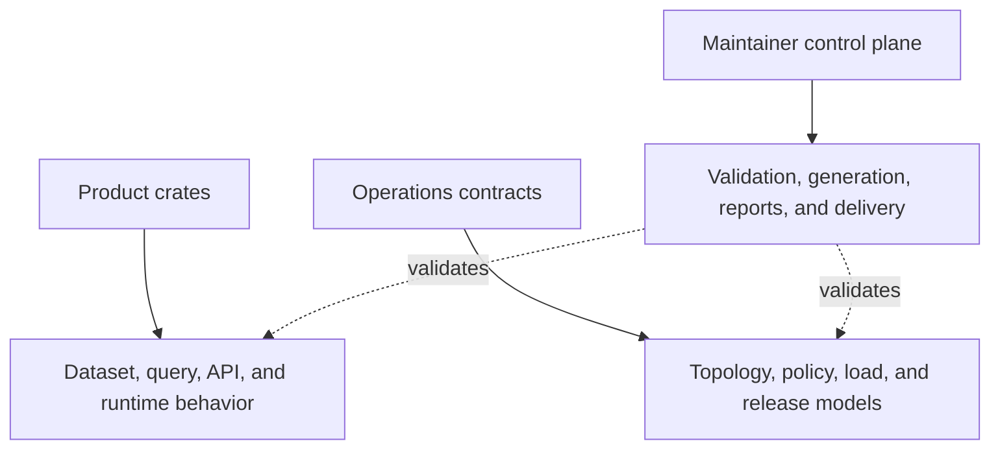
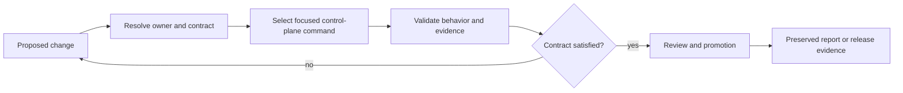
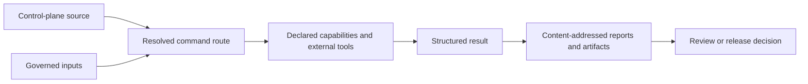
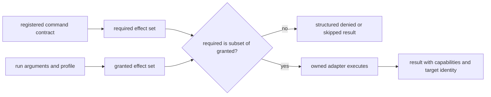
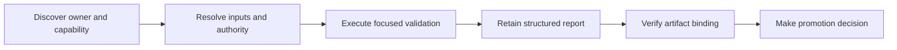
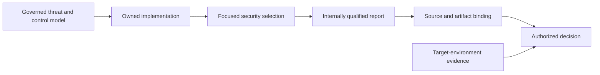

# Atlas Maintainer Overview

Atlas is maintained through a repository control plane, not a collection of
unrelated scripts. `bijux-atlas-dev` gives maintainers and CI one command model
for documentation, configuration, governance, operations, security, load, and
release evidence.

It is repository-only infrastructure. Product behavior remains in the Atlas
runtime crates; reusable operational models remain in `bijux-atlas-ops`.

## Ownership Boundaries


```mermaid
flowchart TB
    Product[Product crates] --> ProductBehavior[Dataset, query, API, and runtime behavior]
    Ops[Operations contracts] --> OpsBehavior[Topology, policy, load, and release models]
    Dev[Maintainer control plane] --> RepoBehavior[Validation, generation, reports, and delivery]
    RepoBehavior -. validates .-> ProductBehavior
    RepoBehavior -. validates .-> OpsBehavior
```

Validation may inspect product and operations contracts, but it does not own
their behavior. Keeping that direction explicit prevents repository automation
from becoming a runtime dependency or a competing implementation of an
operator contract.

## The Maintainer Trust Loop


```mermaid
flowchart LR
    C["Proposed change"] --> O["Resolve owner and contract"]
    O --> P["Select focused control-plane command"]
    P --> V["Validate behavior and evidence"]
    V --> D{"Contract satisfied?"}
    D -->|no| C
    D -->|yes| R["Review and promotion"]
    R --> E["Preserved report or release evidence"]
```

The loop starts with ownership. A values change is evaluated as Kubernetes
configuration; an API change is evaluated against compatibility contracts; a
load change is evaluated against a named scenario and baseline. The command is
chosen after the contract, not before it.

## Control-Plane Entry Points

The direct checkout command is:

```bash
cargo run -p bijux-atlas-dev -- --repo-root "$PWD" --help
```

Installed Bijux environments expose the same surface under:

```bash
bijux dev atlas --help
```

| Question | Start here |
| --- | --- |
| What commands, checks, or reports exist? | `list`, `describe`, `registry`, `reports` |
| Is the documentation coherent? | `docs validate`, `docs links`, `docs nav-integrity` |
| Are repository policies satisfied? | `governance`, `policies`, `invariants`, `check` |
| What would an operational action do? | `ops plan`, `ops describe`, profile and scenario commands |
| Is a deployment shape valid? | `ops render`, `ops validate`, `ops conformance` |
| Has performance changed? | `load baseline`, `load run`, `load compare` |
| Is the release packet coherent? | `release`, `ops evidence`, and verification commands |

Run the relevant command's `--help` before granting write, network, subprocess,
or cluster access. Read-only inspection should remain read-only.

## Evidence Is an Interface

Control-plane commands emit deterministic human or JSON output. Reports carry
the run identity, inputs, findings, status, and owned artifact paths needed by
CI and reviewers. A missing required metric, report, schema, or capability is a
failed or incomplete run—not a successful empty result.

Stable integrations should consume documented commands, registries, schemas,
and report fields. Internal Rust module paths and terminal presentation are not
automation contracts.

## Establish Automation Identity

Before a control-plane result can support a review or release decision, bind
five identities:

| Identity | What to retain |
| --- | --- |
| implementation | source revision and direct binary build identity |
| route | direct, umbrella, CI, or Make invocation plus resolved arguments |
| inputs | governed file hashes, selected profile or scenario, and baseline identity |
| effects | granted capabilities, external tool identities, and mutation targets |
| outputs | report IDs and versions, artifact paths, checksums, and internal status |


```mermaid
flowchart LR
    Source[Control-plane source] --> Route[Resolved command route]
    Inputs[Governed inputs] --> Route
    Route --> Effects[Declared capabilities and external tools]
    Effects --> Result[Structured result]
    Result --> Artifacts[Content-addressed reports and artifacts]
    Artifacts --> Decision[Review or release decision]
```

If the same logical command behaves differently through the direct binary and
umbrella route, preserve both observations and treat route parity as failed.
Do not choose whichever route happens to pass.

## Effects Are Granted Per Run

The control plane distinguishes pure inspection from four effect classes:
filesystem write, subprocess, Git and network. A route declares its required
effects; the run grants them explicitly; the executor refuses or skips work
whose requirement is not granted. A profile or suite name does not grant an
effect by implication.


```mermaid
flowchart LR
    Contract[registered command contract] --> Required[required effect set]
    Request[run arguments and profile] --> Granted[granted effect set]
    Required --> Gate{required is subset of granted?}
    Granted --> Gate
    Gate -->|no| Denied[structured denied or skipped result]
    Gate -->|yes| Execute[owned adapter executes]
    Execute --> Receipt[result with capabilities and target identity]
```

| Effect | Boundary crossed | Receipt requirement |
| --- | --- | --- |
| filesystem write | repository or artifact bytes change | owned paths, before/after identity and generated status |
| subprocess | another executable participates | executable identity, arguments, exit status and result |
| Git | history, index or remote metadata is used | repository, revision, worktree state and operation |
| network | result depends on an external endpoint | endpoint, trust policy, retrieved identity and time |

Capability presence proves only that execution was permitted. The report must
still show that the effect occurred against the intended target and produced a
complete result. Denied effects and missing tools remain visible findings; an
empty output is not converted into successful evidence.

## Command, Report, and Decision Boundaries

The control plane separates inspection, execution, and promotion so that a
successful discovery command cannot be mistaken for evidence of a completed
run.

| Surface | Responsibility | Trust boundary |
| --- | --- | --- |
| `list`, `describe`, registries | discover commands, owners, capabilities, and report types | inventory only; no runtime claim |
| validators and doctors | evaluate a named contract against explicit inputs | valid only for the recorded source and inputs |
| scenario runners | exercise load, conformance, resilience, or release behavior | require metrics and run identity, not an empty report shell |
| report commands | serialize findings and artifact paths | report status must preserve missing or failed evidence |
| release verification | bind reports, checksums, provenance, and artifacts | promotion is invalid when identities disagree |


```mermaid
flowchart LR
    Discover[Discover owner and capability] --> Plan[Resolve inputs and authority]
    Plan --> Run[Execute focused validation]
    Run --> Report[Retain structured report]
    Report --> Verify[Verify artifact binding]
    Verify --> Promote[Make promotion decision]
```

## Security Control Custody

Security assurance crosses four owners. Keeping their identities separate
prevents a passing repository command from being mistaken for production
security proof.

| Owner | Governed surface | Evidence it can supply | Evidence it cannot supply alone |
| --- | --- | --- | --- |
| security model | threats, controls and exceptions | consistent intent and residual-risk records | implementation or target enforcement |
| product and operations | runtime, chart, policy and recovery | revision-bound code and rendered controls | target execution |
| maintainer control plane | validators, tests, reports and workflows | observations for exact inputs and tools | edge identity or production admission |
| decision authority | required claims, findings, target policy and artifact binding | attributable accept, reject or exception | evidence absent from the underlying runs |


```mermaid
flowchart LR
    Model[Governed threat and control model] --> Implementation[Owned implementation]
    Implementation --> Selection[Focused security selection]
    Selection --> Report[Internally qualified report]
    Report --> Binding[Source and artifact binding]
    Binding --> Decision[Authorized decision]
    Target[Target-environment evidence] --> Decision
```

For threat-model changes, run the registry verifier and its positive and
negative command contracts. For authorization or deployment claims, add route,
identity, rendered-policy, admission, and reachability evidence. A threat
registry coverage percentage measures model linkage; it is not a percentage of
production risk removed.

## Working by Risk

- For a documentation-only change, validate structure, navigation, links, and
  rendering without invoking product or cluster suites.
- For a policy or schema change, validate the owning contract and every
  generated consumer affected by it.
- For a security-model change, verify registry linkage, execute the command
  contracts, inspect internal report status, and preserve unresolved findings.
- For an operations change, render first, inspect the plan, then run only the
  profile and conformance evidence needed for that deployment shape.
- For a release decision, require the source identity, governed artifacts,
  checksums, provenance, and verification report to agree.

Broad suites are useful before promotion, but they do not replace focused proof
of the changed contract.

## Handbook Routes

- [Workspace](workspace/index.md) — repository layout, generated assets, local
  development, and contribution boundaries
- [Automation](automation/index.md) — commands, execution, reports, and
  capability controls
- [Governance](governance/index.md) — policies, invariants, compatibility, and
  evidence contracts
- [Delivery](delivery/index.md) — CI, publication, security lanes, and release
  readiness
- [Workflow Ownership](workflow-ownership/index.md) — review routing, required
  checks, and operational workflow entry points

For production operation rather than repository maintenance, continue to the
[Atlas operations handbook](../bijux-atlas-ops/index.md).
