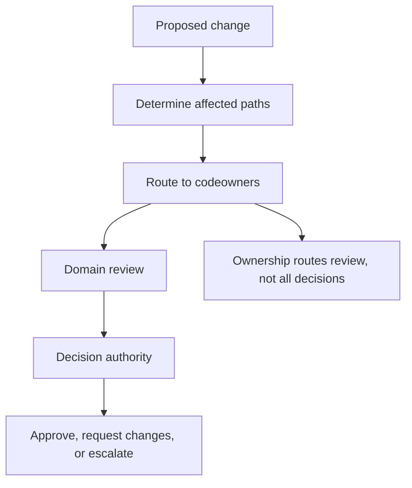

# Codeowners and Review

`CODEOWNERS` is part of the maintainer surface because ownership and review
routing shape how changes actually move through the repository.

## Review Routing Model

This diagram matters because maintainers often overread `CODEOWNERS`. It tells the repository who
must be brought into review for a path, but it does not replace engineering judgment, governance
review, or release-risk escalation.

## Repository Anchor

[`.github/CODEOWNERS`](/Users/bijan/bijux/bijux-atlas/.github/CODEOWNERS:1) is the source of truth
for path-based review routing in this repository.

## What Codeowners Actually Do

- route path-sensitive changes to the maintainer responsible for that boundary
- make review expectations visible before merge pressure appears
- keep infrastructure, docs, governance, config, and crate changes from silently skipping ownership review

## What Codeowners Do Not Do

- they do not by themselves define compatibility policy
- they do not replace required status checks or release gates
- they do not prove that the attached validation is sufficient
- they do not make every owned path equally risky; a docs typo and a workflow gate change still deserve different review depth

## Reading The Current Ownership Map

The current file shows a strong single-owner model around major repository boundaries:

- `.github/workflows/`, `configs/`, `crates/`, `docs/`, `makes/`, and the operational roots all route through the declared owner
- ownership is organized by surface and directory boundary, not by temporary project campaign or time-boxed initiative

That keeps the map durable. A maintainer returning later can still infer the repository decision
boundary from the path itself.

## Review Escalation Rule

Escalate beyond path ownership when a change affects:

- required status checks or workflow gates
- published or machine-consumed surfaces
- compatibility windows, deprecations, or removal timing
- governance exceptions, bypasses, or rule relaxations

## Main Takeaway

`CODEOWNERS` is Atlas's review routing map, not its whole decision system. Use it to bring the right
maintainer into the conversation, then apply the workflow gates, governance rules, and evidence
standards that actually close the decision.
