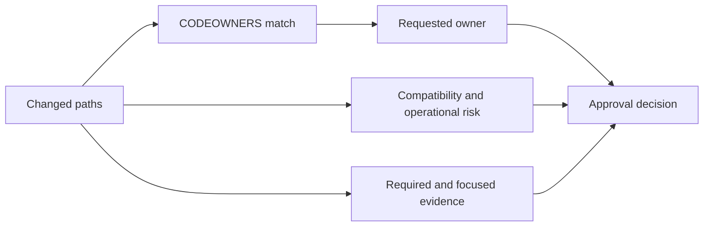

# Codeowners and Review

`CODEOWNERS` routes review requests by path. It does not grant approval,
classify risk, prove validation, or replace branch policy.

```mermaid
flowchart LR
    Change[Changed paths] --> Route[CODEOWNERS match]
    Route --> Reviewer[Requested owner]
    Change --> Risk[Compatibility and operational risk]
    Change --> Checks[Required and focused evidence]
    Reviewer --> Decision[Approval decision]
    Risk --> Decision
    Checks --> Decision
```

## Current Routing Model

The checked-in `.github/CODEOWNERS` is intentionally coarse:

- `* @bijux` supplies the default owner for every path;
- `.github/ @bijux` explicitly covers repository governance and automation;
- `shared/bijux-gh/ @bijux` and `shared/bijux-checks/ @bijux` cover shared
  workflow and check material.

There are no separate checked-in owners for crates, docs, configs, or ops
subtrees. Those paths inherit the default owner. Do not infer domain-specific
review separation that the file does not encode.

## Approval Policy

The `policy / pr approval` workflow applies rules beyond review routing:

- an owner-authored pull request requires the `owner-self-signoff` label;
- a non-owner pull request requires the latest owner review state to be
  `APPROVED`;
- draft state and later review changes remain part of policy evaluation.

This workflow reads the pull request through GitHub's API. A requested owner or
an earlier approval is not sufficient when the latest evaluated state fails the
policy.

## Review Depth

| Change | Review concerns beyond path routing |
| --- | --- |
| generated or synchronized `.github` content | upstream authority, synchronization source, checksum or policy validation |
| public CLI, API, schema, or report | compatibility classification and consumer evidence |
| ops, security, load, or recovery | declared policy versus target-bound execution evidence |
| release workflow | permissions, immutable identity, partial publication, rollback, and receipts |
| documentation | factual authority, reader impact, navigation, links, and focused validation |

## Escalation Boundary

Escalate when a change relaxes a gate, introduces a bypass, alters required
contexts, changes a compatibility window, or affects a domain without encoded
specialist ownership. A single default owner is clear routing, but it is not
evidence that every technical perspective was represented.

## Stability

Ownership patterns and approval-policy labels are repository governance
contracts. Update documentation and branch-policy expectations when their
meaning changes; do not treat a CODEOWNERS edit as sufficient proof that the
new review model is enforced.
