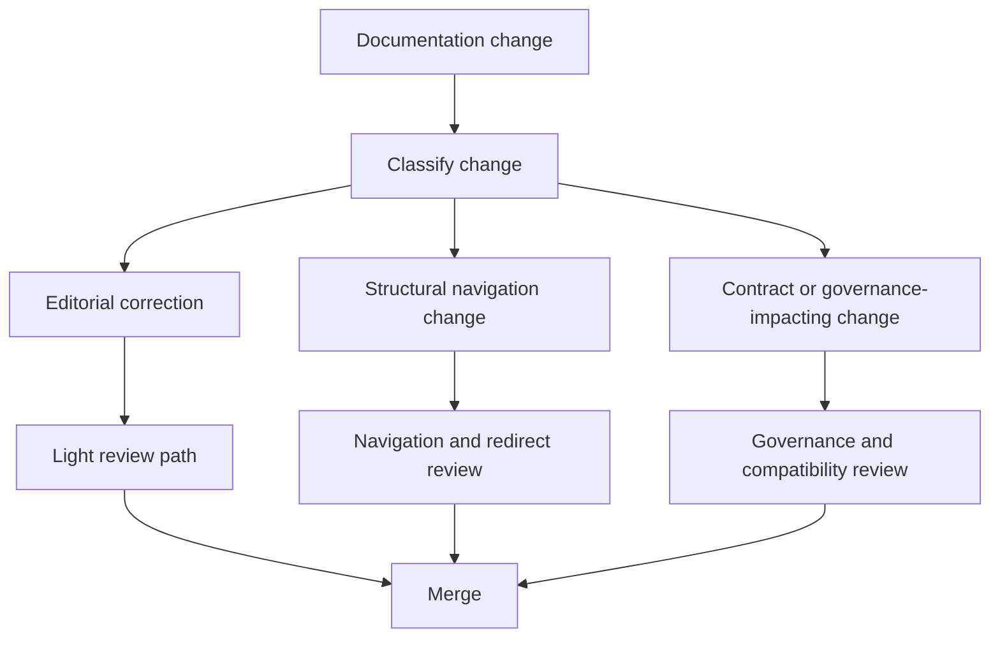

# Docs Governance Workflow

Atlas keeps dedicated docs governance validation so navigation, redirects,
reference generation, and artifact honesty are enforced together.

## Docs Governance Decision Model

This diagram helps maintainers avoid the most common docs mistake: treating every docs edit like the
same kind of change. Atlas separates simple prose fixes from navigation moves and from changes that
alter contracts, redirects, or governance meaning.

## Repository Anchors

- [`.github/PULL_REQUEST_TEMPLATE/docs-governance.md`](/Users/bijan/bijux/bijux-atlas/.github/PULL_REQUEST_TEMPLATE/docs-governance.md:1) records the docs-specific PR obligations
- [`.github/pull_request_template.md`](/Users/bijan/bijux/bijux-atlas/.github/pull_request_template.md:1) records the shared validation and source-of-truth obligations
- docs validation and redirect commands under the maintainer control plane are the execution surface for structural checks

## What This Workflow Protects

- curated docs spine placement
- redirect integrity when pages move or rename
- alignment between authored docs and generated references
- honesty about what is source of truth versus derived artifact

## Practical Maintainer Rules

- use the light path for editorial corrections that do not move meaning, placement, or contract claims
- use the navigation path when URLs, section homes, or redirects change
- use governance review when docs redefine a maintained promise, compatibility expectation, or workflow obligation
- never treat a docs move as complete until redirects and generated navigation stay aligned

## Main Takeaway

Docs governance is Atlas's way of protecting reader trust. The workflow exists so maintainers can
distinguish a harmless wording improvement from a docs change that silently breaks navigation,
compatibility promises, or repository truth.
