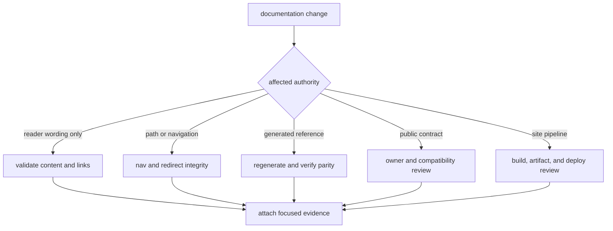

# Documentation Governance Workflow

Documentation changes are governed by the contract they affect. Prose,
navigation, redirects, generated references, command examples, and published
site output have different failure modes and need different evidence.

## Classify the change


```mermaid
flowchart TD
    Change["documentation change"] --> Class{"affected authority"}
    Class -->|reader wording only| Editorial["validate content and links"]
    Class -->|path or navigation| Navigation["nav and redirect integrity"]
    Class -->|generated reference| Generated["regenerate and verify parity"]
    Class -->|public contract| Contract["owner and compatibility review"]
    Class -->|site pipeline| Delivery["build, artifact, and deploy review"]
    Editorial --> Evidence["attach focused evidence"]
    Navigation --> Evidence
    Generated --> Evidence
    Contract --> Evidence
    Delivery --> Evidence
```

Reader-facing pages must explain the product or operation directly. Workspace
agreements, editorial instructions, and assistant-facing control text do not
belong in the published MkDocs tree.

## Repository surfaces

The default pull-request template asks for the user or operator outcome,
changed surfaces, targeted validation, contract changes, generated artifacts,
docs, release risk, and rollback. There is no checked-in docs-specific pull
request template today. Do not refer contributors to one.

The principal documentation authorities are:

- authored pages under `docs/`;
- navigation and redirect mappings in `mkdocs.yml`;
- redirect source data under `configs/sources/repository/docs/`;
- generated reference ownership in the maintainer control plane;
- site build settings in `.github/docs-deploy.env`;
- scheduled or manual audit behavior in `docs-audit.yml`;
- the reusable or manual deployment workflow in `deploy-docs.yml`.

## Focused validation

Use the narrowest checks that match the change, then escalate for structural or
delivery changes:

```bash
cargo run -p bijux-atlas-dev -- docs validate --format json
cargo run -p bijux-atlas-dev -- docs lint --format json
cargo run -p bijux-atlas-dev -- docs nav-integrity --format json
cargo run -p bijux-atlas-dev -- docs reference check \
  --allow-subprocess \
  --format json
```

When a page moves, update the redirect source and synchronize generated redirect
maps through `docs redirects sync --allow-write`. Review the generated diff and
verify both the former URL and the destination.

Generated references must be changed at their source. A parity check that fails
after a handwritten edit is evidence that the wrong artifact was modified.

## Automation coverage and limits

The weekly or manual docs audit installs the docs toolchain, runs Markdown lint,
checks external links, verifies generated references, builds a strict preview,
and writes an audit packet. The preview is retained for five days and audit
evidence for 14 days.

That workflow does not run on every pull request. The deploy workflow is manual
or reusable and consumes repository-configured install, build, and site paths.
The checked-in `main` ruleset does not currently require a docs-specific status
context. Maintainers must not infer per-PR documentation coverage from the
existence of scheduled audit and deployment workflows.

## Acceptance rules

A documentation change is complete when:

- the public claim matches current code, configuration, and evidence;
- commands and paths exist and use supported interfaces;
- local filesystem paths and editorial narration are absent from public pages;
- navigation, redirects, and generated references remain coherent;
- diagrams clarify real ownership or sequence;
- focused validation passes and any broader deferred check is named;
- the pull request records compatibility and rollback impact where relevant.

Site deployment success proves that an artifact was built and published. It
does not prove every product claim in that artifact is true; source review and
domain evidence still own that decision.
