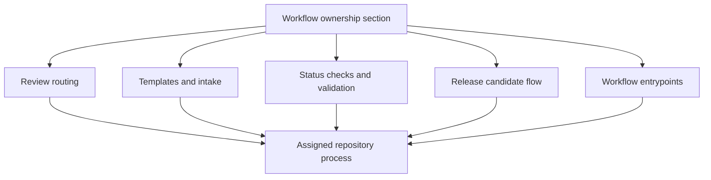

# Workflow Ownership

`bijux-atlas-dev/workflow-ownership` is the section home for this handbook slice.

Workflow ownership is where repository process becomes explicit, assigned, and
reviewable. These pages should help maintainers see how CODEOWNERS, templates,
required checks, and release or validation workflows fit together into one
ownership system rather than a collection of unrelated files.

## Source Map

- review routing and ownership signals: `.github/CODEOWNERS`
- issue and pull request intake: `.github/ISSUE_TEMPLATE/` and
  `.github/PULL_REQUEST_TEMPLATE*`
- required checks and release workflows: `.github/workflows/` and
  `.github/required-status-checks.md`

## Pages

- [Codeowners and Review](codeowners-and-review.md)
- [Docs Governance Workflow](docs-governance-workflow.md)
- [Issue Templates](issue-templates.md)
- [Ops Validation Workflow](ops-validation-workflow.md)
- [Pull Request Templates](pull-request-templates.md)
- [Release Candidate Workflow](release-candidate-workflow.md)
- [Required Status Checks](required-status-checks.md)
- [Sustainability Validation Workflow](sustainability-validation-workflow.md)
- [System Simulation Workflow](system-simulation-workflow.md)
- [Workflow Entrypoints](workflow-entrypoints.md)
