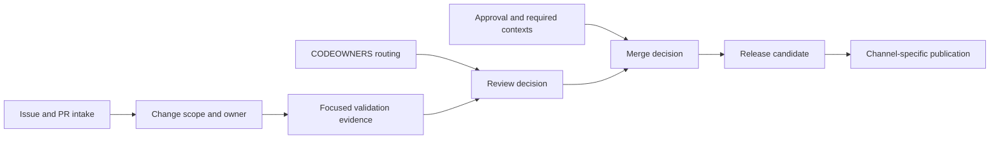

# Workflow Ownership

Atlas separates intake, review routing, validation, merge policy, release
decisions, and publication. These mechanisms cooperate, but none is a substitute
for the others: a requested reviewer is not an approval, a completed template
is not evidence, and a green domain workflow is not automatically a required
merge context.

```mermaid
flowchart LR
    Intake[Issue and PR intake] --> Scope[Change scope and owner]
    Ownership[CODEOWNERS routing] --> Review[Review decision]
    Scope --> Evidence[Focused validation evidence]
    Evidence --> Review
    Policy[Approval and required contexts] --> Merge[Merge decision]
    Review --> Merge
    Merge --> Candidate[Release candidate]
    Candidate --> Publish[Channel-specific publication]
```

## Route by Decision

| Decision | Primary guide | Repository authority |
| --- | --- | --- |
| where a report or proposal enters | [Issue Templates](issue-templates.md) | `.github/ISSUE_TEMPLATE/` |
| what a change author declares | [Pull Request Templates](pull-request-templates.md) | `.github/PULL_REQUEST_TEMPLATE/` |
| who receives review requests | [Codeowners and Review](codeowners-and-review.md) | `.github/CODEOWNERS` |
| which contexts gate `main` | [Required Status Checks](required-status-checks.md) | ruleset and required-status documentation |
| which workflow matches a claim | [Workflow Entrypoints](workflow-entrypoints.md) | workflow triggers, jobs, and delegated commands |
| whether operations contracts hold | [Ops Validation Workflow](ops-validation-workflow.md) | `ops-validate.yml` and its emitted evidence |
| whether documentation is coherent | [Documentation Governance Workflow](docs-governance-workflow.md) | docs commands, navigation, redirects, audit, and deploy workflows |
| whether a candidate is promotable | [Release Candidate Workflow](release-candidate-workflow.md) | candidate and readiness workflows |

## Specialized Validation

- [Sustainability Validation Workflow](sustainability-validation-workflow.md)
  distinguishes declared models from measured signals.
- [System Simulation Workflow](system-simulation-workflow.md) explains the
  simulation target, scenario selection, and evidence boundary.

## Evidence Rules

For every workflow-backed claim, record the triggering revision, event,
selected command or suite, granted capabilities, external target when present,
structured result, and process or job outcome. Scheduled, manual, and reusable
workflows do not imply per-pull-request coverage unless a triggering workflow
actually calls them and branch policy requires the resulting context.

Workflow names, job names, permissions, path filters, delegated commands, and
artifact retention are reviewable contracts. When shared-standard content owns
a workflow or template, change the upstream authority and synchronize it rather
than allowing downstream copies to drift.
