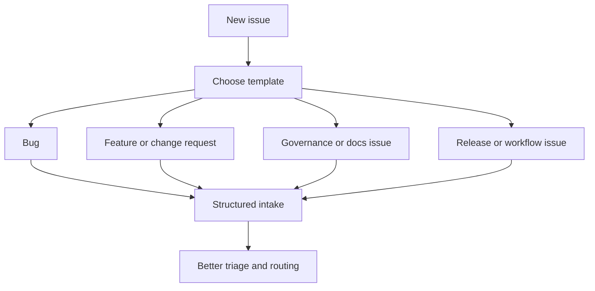

# Issue Templates

Issue templates capture recurring maintainer inputs such as performance
regressions and security advisory workflows.

## Intake Model

This diagram matters because issue templates are really intake contracts. They
decide what information a maintainer gets before triage and whether the issue
arrives with enough structure to route cleanly.

## Repository Anchors

- [`.github/ISSUE_TEMPLATE/perf-regression.md`](/Users/bijan/bijux/bijux-atlas/.github/ISSUE_TEMPLATE/perf-regression.md:1)
- [`.github/ISSUE_TEMPLATE/security-advisory.yml`](/Users/bijan/bijux/bijux-atlas/.github/ISSUE_TEMPLATE/security-advisory.yml:1)

## Main Takeaway

Issue templates are part of Atlas workflow ownership because they shape the
quality of maintainer intake before any review or validation begins. A good
template reduces triage guesswork and makes routing more deliberate.
