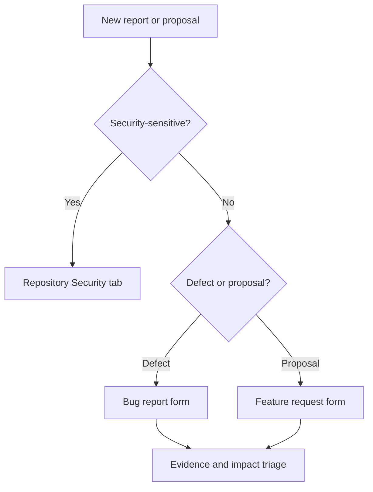

# Issue Templates

Atlas provides two public issue forms: bug reports and feature requests. Blank
issues are disabled. Security reports are explicitly routed to GitHub's private
security-reporting surface and must not be filed as public issues.

```mermaid
flowchart TD
    Need[New report or proposal] --> Sensitive{Security-sensitive?}
    Sensitive -- Yes --> Private[Repository Security tab]
    Sensitive -- No --> Kind{Defect or proposal?}
    Kind -- Defect --> Bug[Bug report form]
    Kind -- Proposal --> Feature[Feature request form]
    Bug --> Triage[Evidence and impact triage]
    Feature --> Triage
```

## Bug Report Contract

The bug form requires an affected surface, current behavior, expected behavior,
and exact reproduction steps. Evidence and impact are available but currently
optional. A high-quality report should still include both: logs or artifact
paths make the observation reviewable, and impact determines priority and
routing.

Use repository-relative paths and stable command names in the affected-surface
field. Reproduction steps should identify inputs and environment, and should
separate the observed result from the expected contract.

## Feature Request Contract

The feature form requires an affected surface, problem statement, proposed
change, and concrete success criteria. Alternatives and additional context are
optional. Success criteria should be observable: name the interface, behavior,
or evidence that would establish completion.

A feature issue is not a decision record. Changes to public contracts,
operations boundaries, or compatibility policy may still require their owning
design and governance artifacts before implementation.

## Security Boundary

The issue configuration links to `https://github.com/bijux` and instructs
reporters to use the repository Security tab. The link is organization-wide,
not a repository-specific advisory URL. Maintainers should verify that private
reporting remains reachable from the published repository and avoid copying
sensitive details into an ordinary issue while routing a report.

## Ownership

The files under `.github/ISSUE_TEMPLATE/` are synchronized shared-standard
content and covered by the repository's standards checksum. Change their
upstream authority and refresh the synchronized files; do not hand-edit a
downstream form as if it were independently owned.

Issue forms improve intake consistency, but they do not establish severity,
ownership, reproducibility, or acceptance by themselves. Triage still owns
those decisions and should preserve links to the evidence used.
