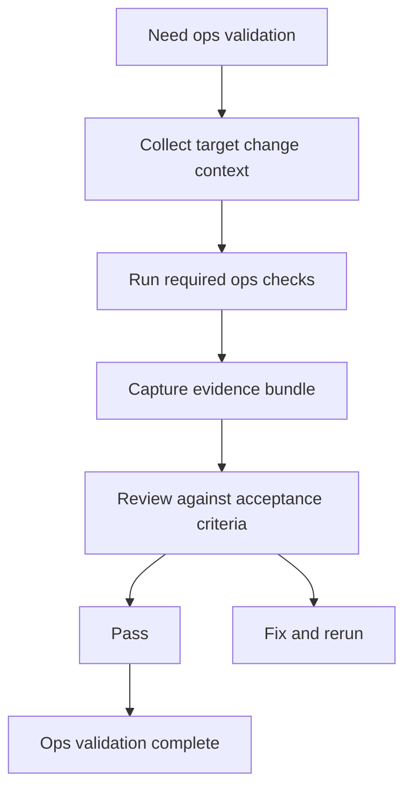

# Ops Validation Workflow

The ops validation workflow is the CI path that keeps the Atlas operating
surface honest as Helm, Kubernetes, and stack assets evolve.

## Ops Validation Model

This page is about the repository workflow, not only the local command. The workflow exists so ops
changes produce a repeatable CI evidence bundle instead of relying on a maintainer's local cluster or
memory.

## Source Anchor

[`.github/workflows/ops-validate.yml`](/Users/bijan/bijux/bijux-atlas/.github/workflows/ops-validate.yml:1)
is the source of truth for the current ops validation lane.

## What The Workflow Covers

The current workflow:

- triggers on changes to `ops/**`, `crates/bijux-dev-atlas/**`, `makes/ops.mk`, and the workflow itself
- prepares isolated cache and temp roots under `artifacts/isolates/ops-validate`
- runs `make doctor`, `make makes-target-list`, and `make ops-validate`
- captures JSON reports for doctor, makes target inventory, ops validate, schema validate, inventory validate, and k8s render
- uploads the resulting artifact bundle for review

## Why This Matters

Ops changes are rarely safe to review from code alone. The workflow turns deployment, schema,
inventory, and render checks into one named evidence set so a maintainer can judge whether the ops
surface still behaves coherently.

## Main Takeaway

The ops validation workflow is Atlas's remote proof path for operational changes. If a change can
affect stack, render, schema, or inventory behavior, this workflow should leave behind enough
evidence that another maintainer can understand the result without reproducing the whole environment.
