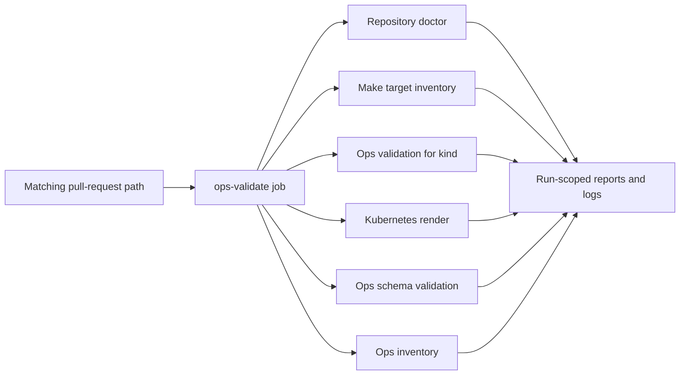

# Ops Validation Workflow

`.github/workflows/ops-validate.yml` is the path-scoped pull-request lane for
the checked-in operational surface. It validates repository contracts and
renders the `kind` profile. It does not provision a cluster or establish live
service behavior.

```mermaid
flowchart LR
    Change[Matching pull-request path] --> Lane[ops-validate job]
    Lane --> Doctor[Repository doctor]
    Lane --> Targets[Make target inventory]
    Lane --> Validate[Ops validation for kind]
    Lane --> Render[Kubernetes render]
    Lane --> Schema[Ops schema validation]
    Lane --> Inventory[Ops inventory]
    Doctor --> Bundle[Run-scoped reports and logs]
    Targets --> Bundle
    Validate --> Bundle
    Render --> Bundle
    Schema --> Bundle
    Inventory --> Bundle
```

## Trigger Boundary

The workflow runs for pull requests changing:

- `ops/**`;
- `crates/bijux-atlas-dev/**`;
- `makes/ops.mk`;
- `.github/workflows/ops-validate.yml`.

Changes outside those paths do not trigger this lane even if they affect
runtime behavior relevant to operations. Cross-boundary changes need the
appropriate product, system, security, load, or release evidence in addition
to this path filter.

## Executed Checks

| Workflow operation | Retained evidence |
| --- | --- |
| `make FORMAT=json doctor` | doctor logs and copied doctor reports when produced |
| `make help` and `make makes-target-list` | command logs and `makes-target-list.json` |
| `make FORMAT=json ops-validate` | stdout and stderr logs |
| `bijux-atlas-dev ops validate --profile kind` | `reports/ops-validate.json` |
| `make FORMAT=json k8s-render` | render logs and copied render report when produced |
| `bijux-atlas-dev ops schema validate` | `reports/ops-schema-validate.json` |
| `bijux-atlas-dev ops inventory` | `reports/ops-inventory-validate.json` |

The workflow runs the doctor twice: once during the main validation operation
and once as the named required doctor operation. Both results can appear in the
bundle under different report names.

## Evidence Custody

The run identifier includes the pull-request or workflow run identity plus the
attempt. Reports, logs, and the summary are uploaded from
`artifacts/<run-id>/` even on failure, with five-day retention. Cargo state is
cached separately beneath `artifacts/isolates/ops-validate` and is not included
as operational proof.

The job declares network access for its command environment, but it does not
create a Kind cluster, run load traffic, inject failures, execute the declared
Kubernetes conformance catalog, or verify rollout and recovery against a live
deployment. Those claims require their dedicated lanes and target-bound
reports.

## Review Decision

A green run establishes that the selected repository commands accepted the
checked-in ops surface for the `kind` profile on the hosted runner. Reviewers
must still inspect which reports were present, the source revision, and whether
the change requires runtime evidence beyond structural validation.

## Stability

Trigger paths, command selection, report names, and artifact retention are part
of the workflow contract. Changing them alters which operational changes are
observed and what reviewers can recover from a run.
