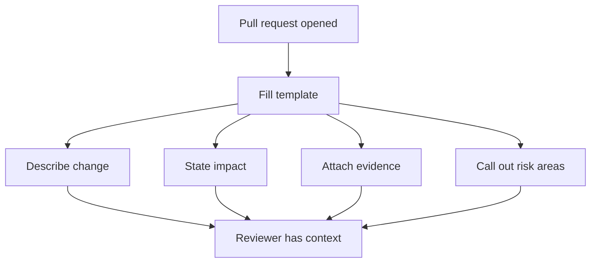

# Pull Request Templates

Pull request templates encode review expectations for docs, ops, and general
repository changes.

## Template Value Model

This is the real job of a PR template in Atlas: to force the change story, the evidence story, and
the risk story into one place before reviewer time gets spent.

## Source Anchors

- [`.github/pull_request_template.md`](/Users/bijan/bijux/bijux-atlas/.github/pull_request_template.md:1) is the default repository template
- [`.github/PULL_REQUEST_TEMPLATE/docs-governance.md`](/Users/bijan/bijux/bijux-atlas/.github/PULL_REQUEST_TEMPLATE/docs-governance.md:1) adds docs-specific governance checks
- [`.github/PULL_REQUEST_TEMPLATE/ops-e2e-boundary.md`](/Users/bijan/bijux/bijux-atlas/.github/PULL_REQUEST_TEMPLATE/ops-e2e-boundary.md:1) adds boundary checks for ops end-to-end work

## What The Default Template Forces Into View

- a plain-language summary of the visible repository change
- validation expectations such as `make ci-fast`, `make ci-pr`, and focused command reruns
- source-of-truth checks for contracts, generated artifacts, redirects, and docs alignment
- risk disclosures for breaking changes and ops boundary changes

## Why This Matters

Without the template, important maintainer facts stay implicit:

- whether the author changed the owning source before the docs
- whether generated artifacts were refreshed
- whether a moved docs page got its redirect update
- whether a workflow or ops change crossed the wrong boundary

The template turns those from reviewer guesswork into author-declared evidence.

## When To Update A Template

Update PR templates when the repository changes what must be proven for merge, such as:

- new required validation lanes
- new source-of-truth locations
- new docs governance obligations
- new ops boundary rules

Do not update templates casually for stylistic preference alone. A template change is a review-model
change and should stay durable and repo-wide.

## Main Takeaway

PR templates are part of Atlas governance, not repository decoration. They define the minimum story
a maintainer must tell about a change before review can be efficient, consistent, and honest.
