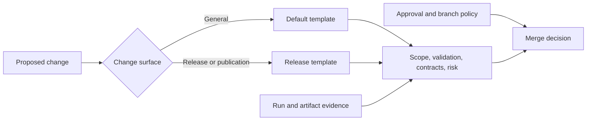

# Pull Request Templates

Atlas provides two pull-request templates under
`.github/PULL_REQUEST_TEMPLATE/`: `default.md` for general changes and
`release-change.md` for publication and artifact-pipeline work. There is no
root `.github/pull_request_template.md` and no checked-in docs- or ops-specific
template.

```mermaid
flowchart LR
    Change[Proposed change] --> Template{Change surface}
    Template -- General --> Default[Default template]
    Template -- Release or publication --> Release[Release template]
    Default --> Review[Scope, validation, contracts, risk]
    Release --> Review
    Evidence[Run and artifact evidence] --> Review
    Policy[Approval and branch policy] --> Decision[Merge decision]
    Review --> Decision
```

## General Change Template

The general template asks for:

- a user- or operator-facing outcome and an owning issue, incident, or decision
  record;
- changed surfaces, non-goals, and intentionally untouched areas;
- fast checks, targeted tests, and a CI link;
- contract, schema, generated-artifact, and user-documentation impact; and
- breaking-change and rollback disclosures.

These are author attestations. Checking a box does not replace the command
output, report, workflow run, or reviewer analysis that supports it.

## Release Change Template

The release template focuses on `release.env`, workflow parity, explicit
package and crate scope, YAML parsing, shared-standard parity, dry-run evidence,
duplicate publication, gates, and fallback behavior.

It does not cover every release obligation. Immutable source identity,
provenance, signing, channel-specific receipts, partial publication, and
rollback constraints still come from the release contracts and workflows.

## Approval Boundary

Templates collect a change narrative; they do not enforce approval. Atlas's
pull-request approval workflow separately requires an owner-authored pull
request to carry the `owner-self-signoff` label. A non-owner change requires
the latest owner review state accepted by that workflow. Branch protection and
required status contexts remain separate decisions.

## Ownership

Both templates are synchronized shared-standard files and are named in the
repository standards checksum. Make durable template changes at their upstream
authority, then refresh and validate the synchronized content. A local edit can
be overwritten by the next standards synchronization and must not be treated as
an independent repository policy change.

Select the template that matches the dominant risk, then add any domain evidence
the template does not ask for. Template completeness is an intake condition,
not proof that the change is safe to merge.
